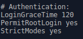

# Clientes ligeros LTSP/Ubuntu

Para empezar esta práctica, debemos configurar dos máquinas virtuales. Una de ellas hará de *servidor*, y otra de *cliente*.

La máquina que hará de **servidor** la configuraremos con dos tarjetas de red, una de ellas en *adaptador puente* y otra con *red interna*.

>La que lleva la red interna, la llamamos "red-interna", ya que tiene que tener el mismo nombre que en la máquina cliente.

La máquina **cliente** la configuraremos con una tarjeta de red en modo *red interna*, con el nombre indicado anteriormente ("red-interna"), y sin disco duro, ya que la instalación del S.O se realizará a través de la red ofrecida por el servidor.

* En la máquina *servidor*, ya con las IP's configuradas, realizamos estos comandos para comprobar que todo está correcto y podemos empezar a trabajar sin errores.

> La lista de comandos es:

> ip a

> route n

> hostname -a

> hostname -f

> uname -a

> blkid

* Lo siguiente será crear 3 usuarios, podemos hacerlo mediante entorno gráfico o rápidamente con el comando *adduser <nombredeusuario>*.

* Instalamos el servidor openssh utilizando *apt-get install openssh-server*.

> Y una vez instalado, tenemos que ir al fichero de configuración de ssh y modificarlo, añadiendo **yes** en el campo *PermitRootLogin*

* Instalamos el servidor de clientes ligeros con el comando *apt-get install ltsp-server-standalone*.

* Y creamos la imagen del sistema con *ltsp-build-client*.

* En el archivo de configuración */etc/cat/ltsp/dhcpd.conf* debemos cambiar el *option root-path* y los *filenames* añadiendo **amd64** para que la imagen sea en 64 bits.

> También debemos cambiar los *range* de las IP, siendo nuevamente range 192.168.67.119 192.168.67.219

* Reiniciamos el servidor, comprobamos que todo va bien, y vamos a proceder con la máquina cliente. Recordemos que no tiene ningún disco duro, ni imagen ISO, y la tarjeta de red interna.

* Al iniciar la máquina, pulsamos **F12** y vamos al *menú boot*, y aquí pulsamos la *l*, para iniciar desde LAN, es decir, desde la red del servidor.

# Adán Pérez
