# Servidor de impresión en Windows.

---

* Utilizaremos una máquina servidor y una máquina cliente.
  * Máquina servidor: Windows Server 2012.
  * Máquina cliente: Windows 10.

---

## Rol de impresión.

* Vamos a instalar en el servidor el rol de impresión.
  * `Asistente para agregar roles y características` -> `Servicios de impresión y documentos`.

* En servicios de rol elegimos los siguiente:
  * `Servidor de Impresión` + `Impresión en Internet`

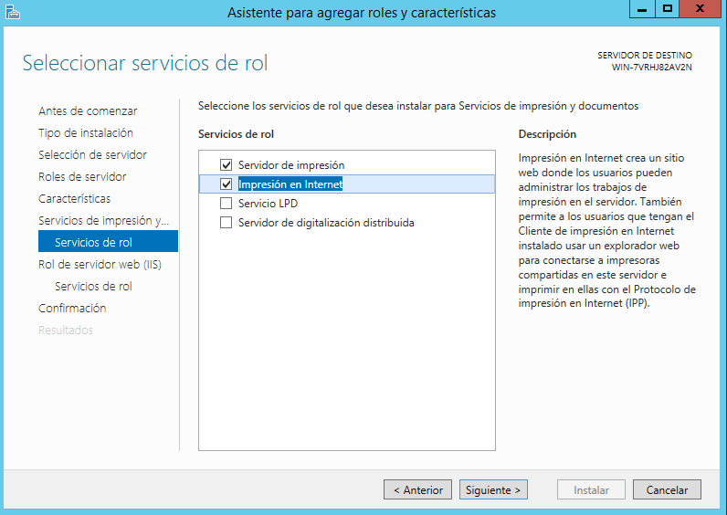

* Y procedemos a la instalación.
  * Seleccionamos la casilla de *Reiniciar automáticamente* por si es necesario.

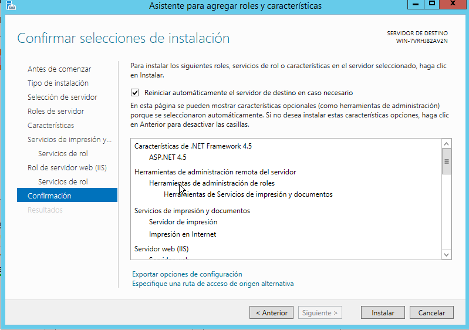

---

## Instalar impresora PDF.

* Vamos a instalar PDF Creator.
  * Para ello vamos a la página web oficial de *PDF Creator* y buscamos el apartado **Descarga**.
  * Descargamos, y ejecutamos el *setup*.

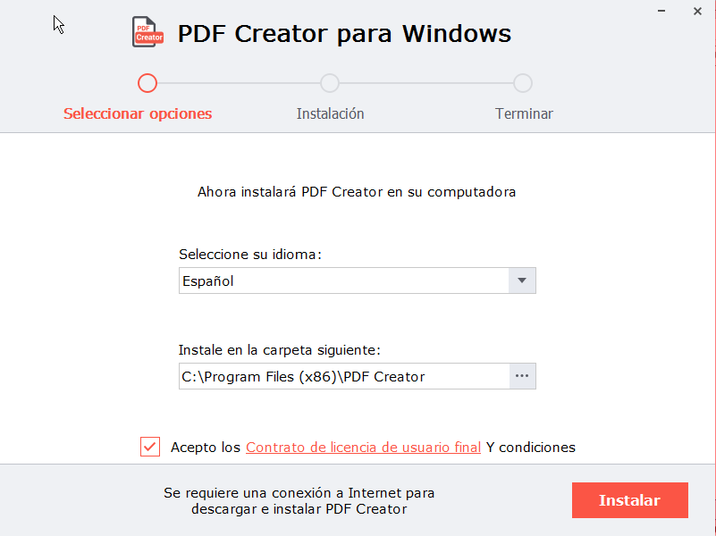

* Si es necesario, habrá que instalar también el `Microsoft Visual C++ 2015`.

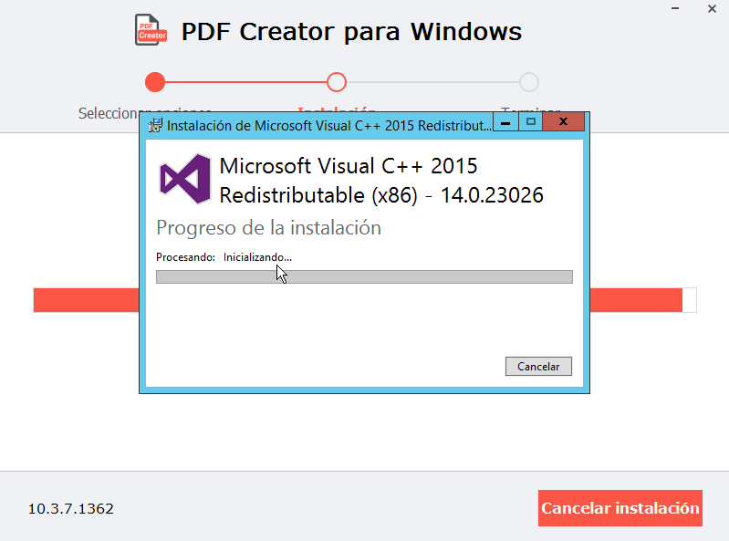

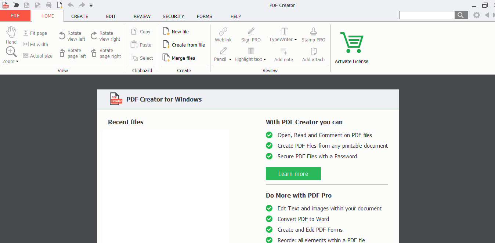

---

## Probar impresora en local.

* Seleccionamos cualquier *txt* (por ejemplo) que queramos imprimir, le damos *Click derecho -> Imprimir* y elegimos la opción `Impresora PDF`.

* Le damos un nuevo nombre (si queremos) al archivo, y ya lo tendríamos en `.pdf` y listo.

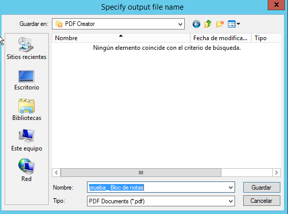

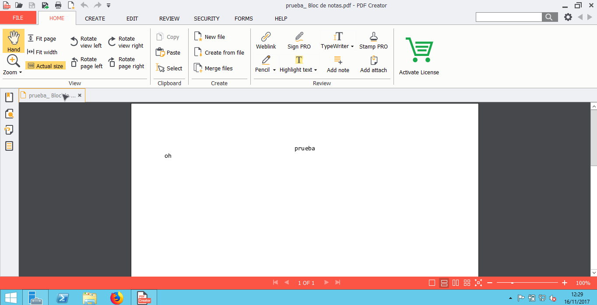

---

## Compartir por red.

* Vamos a nuestro servicio de impresión.
  * *Administración de servidor* -> *Panel* -> *Administración de impresión* -> *PDF Pro Virtual Printer*

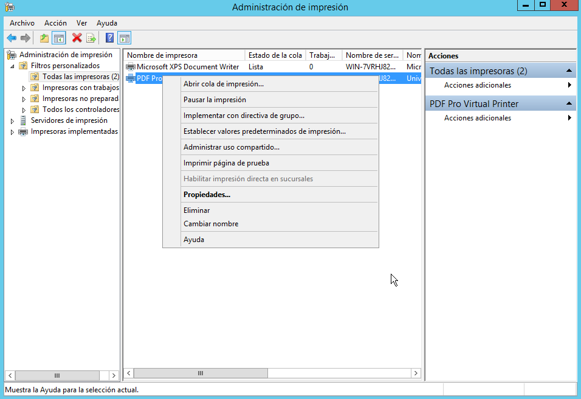

* *Click derecho* -> *Propiedades* -> *Compartir*
  * Le ponemos el nombre que queramos.

* Nos movemos al cliente, entramos en **red** y seleccionamos nuestra impresora. Para entrar nos pedirá las credenciales de Windows Server.

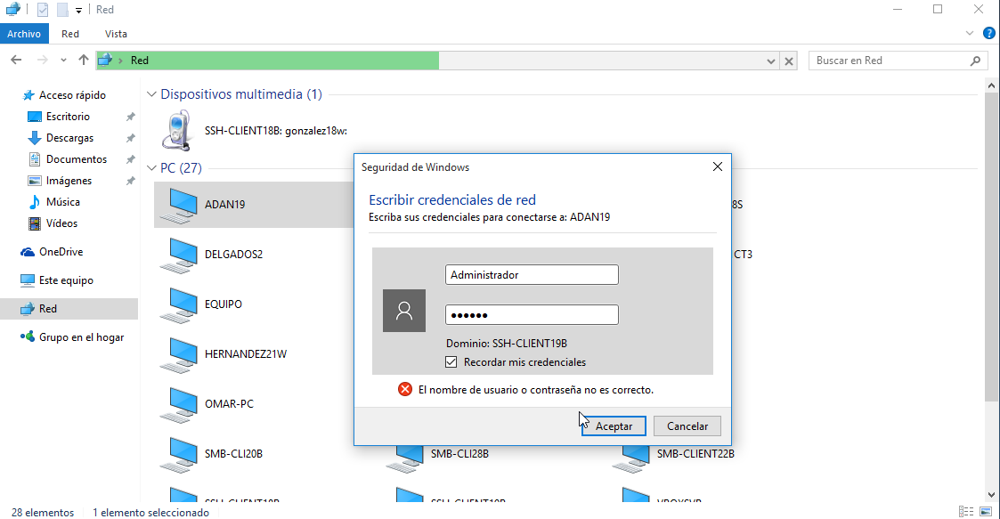

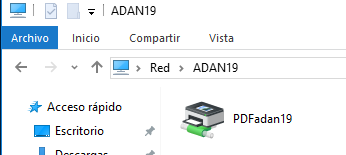

* Probamos a imprimir un archivo en el cliente, y luego comprobar en el servidor.

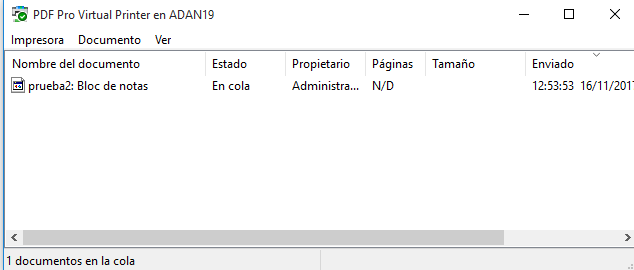

* Cuando vamos al servidor, en la carpeta **Documentos** tendría que estar el PDF.

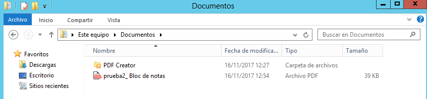

---

## Acceso Web

>   Vamos al servidor.
    Nos aseguramos de tener instalado el servicio "Impresión de Internet".

* En la máquina cliente, abrimos un navegador y en la barra de navegación escribimos: `http://<nombre-del-servidor>/printers`

* Configuramos ahora la posibilidad de imprimir desde la red en esa impresora compartida utilizando la URL conocida.
  * Y comprobamos desde el propio navegador que podemos pausar, reanudar, y envíar archivos a la impresora.

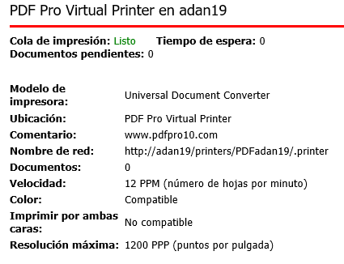

---
