# 1. Windows - Tarea diferida.

Vamos a hacer una tarea diferida con Windows. Una tarea diferida se define para ejecutarse una sola vez en una fecha futura.

* Configurar la MV
* En Windows 7 para abrir el programador de tareas hacemos Panel de control -> Herramientas administrativas -> Programador de tareas.
* Vamos a programar una tarea diferida. Ejemplos:
  * Mostrar un mensaje en pantalla.
  * Abrir un fichero de texto en pantalla.
  * Iniciar un programa determinado (Firefox).

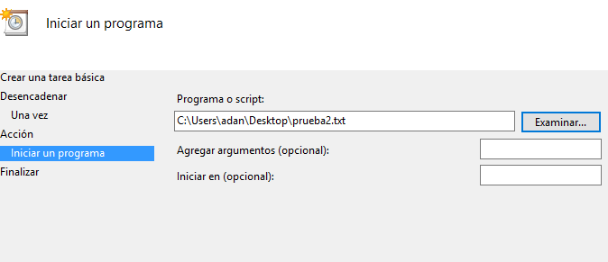

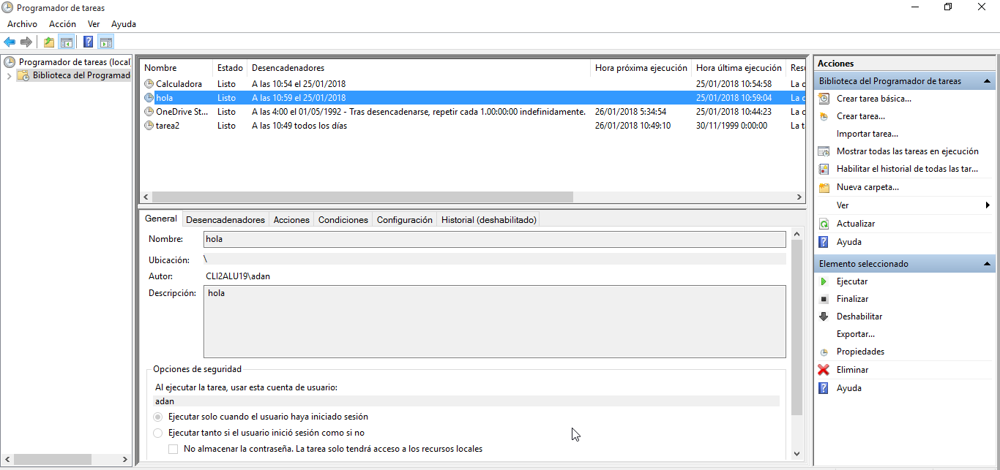

---

# 2. Windows - Tarea periódica

La tarea programada se define para ejecutarse periódicamente cada intervalo de tiempo.

* Vamos a programar una tarea periódica para apagar el equipo.
* El comando para apagar el sistema es shutdown. shutdown /?, muestra la ayuda del comando.

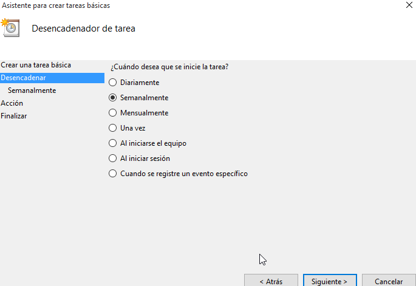

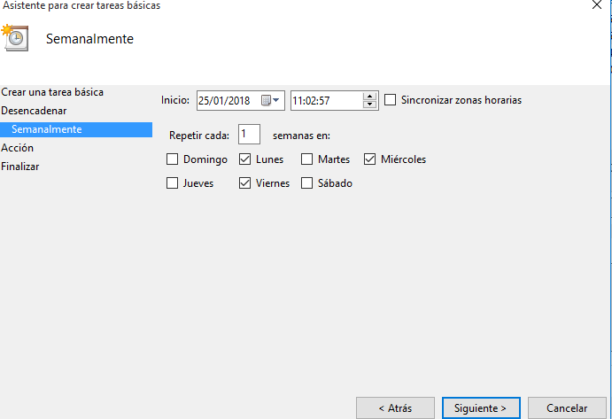

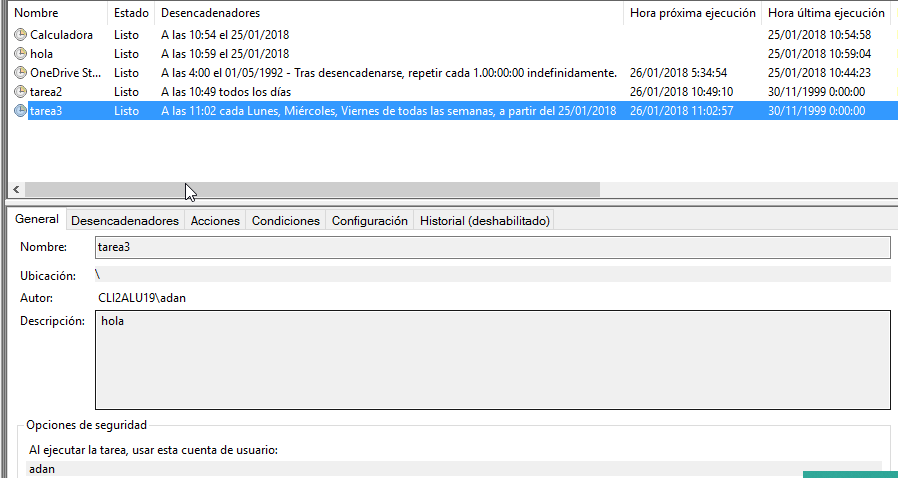

---

# 3. SO GNU/Linux - Tarea diferida

Vamos a hacer una tarea diferida con GNU/Linux.

* Configurar OpenSUSE

* El servicio atd es el responsable de la ejecución de los comandos at. Comprobar que esté en ejecución:
  * Yast -> Servicios
  * systemctl status atd

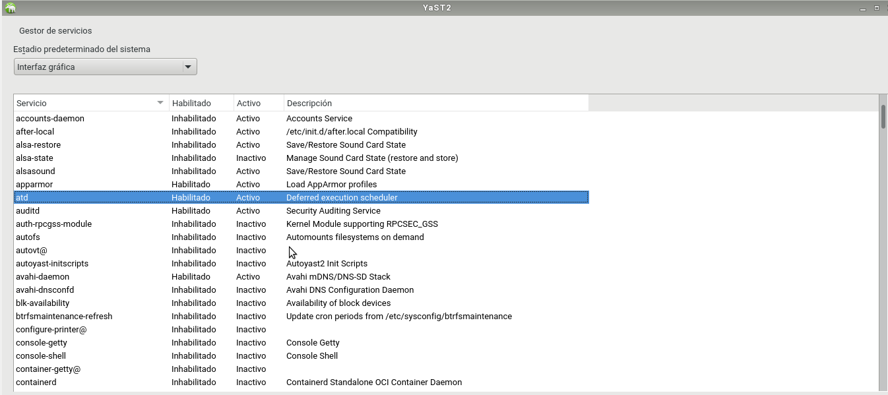

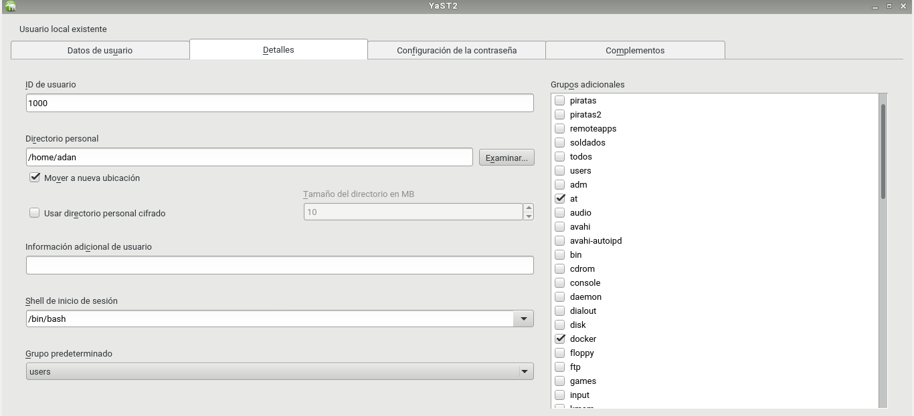

* Ejemplos de comandos:
  * at, crea una tarea diferida.
  * atq, muestra los trabajos en cola.
  * at -c 1, muestra la configuración del trabajo ID=1.
  * atrm 1, elimina el trabajo con ID=1.
  * Otra forma de trabajar con at: at 11:45 Feb 28 < scriptname.sh

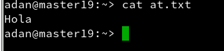

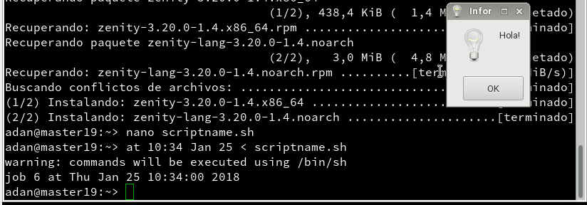

Ejemplo de script que muestra un mensaje de aviso:

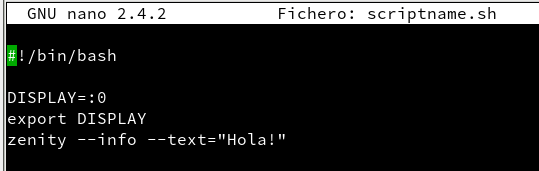

---

# 4. GNU/Linux - Tarea periódica

Para programar una tarea periódica tenemos dos formas:

* crontab -l, para consultar que no hay tareas programadas.
* Por defecto se usa el editor vim para modificar crontab. Si queremos usar el editor nano, hacemos export VISUAL'nano'.
* crontab -e, abre el editor para crear una nueva tarea periódica.
* Definir una tarea periódica (crontab) para apagar el equipo todos los días a una hora/minuto determinada.
* Para salir del editor vim, escribimos la secuencia ESC, : y wq.
* crontab -l, para consultar la tarea que tenemos programada.

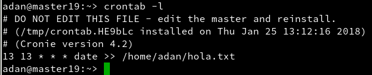

---
