# Puppet

---

## Configuración

* Vamos a usar 3 MV's con las siguientes configuraciones:
  * MV1 - master: Dará las órdenes de instalación/configuración a los clientes.
      * Configuración OpenSUSE.
      * IP estática 172.18.19.100
      * Nombre del equipo: master19
      * Dominio: curso1718

  * MV2 - cliente 1: recibe órdenes del master.
      *  Configuración OpenSUSE.
      *  IP estática 172.18.19.101
      *  Nombre del equipo: cli1alu19
      *  Dominio: curso1718
  * MV3 - client2: recibe órdenes del master.
      *  Configuración SO Windows 10.
      *  IP estática 172.18.19.102
      *  Nombre Netbios: cli2alu19
      *  Nombre del equipo: cli2alu19

* Configurar /etc/hosts
  * Cada MV debe tener configurada en su /etc/hosts al resto de hosts, para poder hacer ping entre ellas usando los nombres. Con este fichero obtenemos resolución de nombres para nuestras propias MV's sin tener un servidor DNS

* Comprobar las configuraciones.
  ```
  date
  ip a
  route -n
  host www.google.es
  hostname -a
  hostname -f               
  hostname -d               
  tail -n 5 /etc/hosts
  ping master19
  ping master19.curso1718
  ping cli1alu19
  ping cli1alu19.curso1718
  ping cli2alu19
  ```


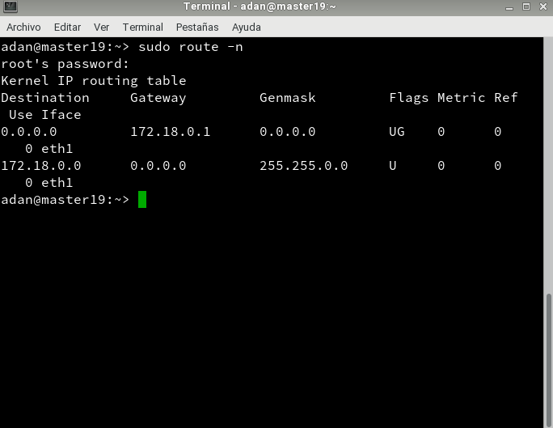

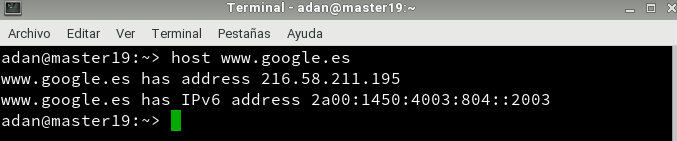

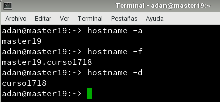


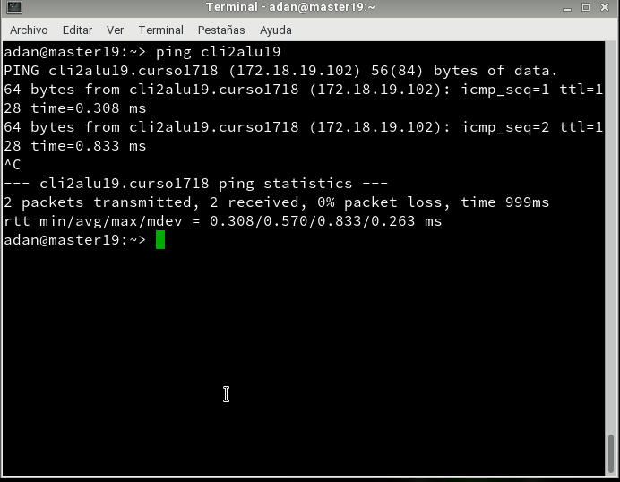

* En Windows comprobamos con:

```
date
ipconfig
route PRINT
nslookup www.google.es
ping masterXX
ping masterXX.curso1718
ping cli1aluXX
ping cli1aluXX.curso1718
ping cli2aluXX
```


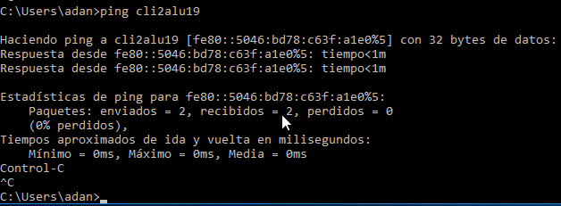

---

## Primera versión del fichero pp

* Instalamos Puppet Master en la MV masterXX:


* `systemctl status puppetmaster`: Consultar el estado del servicio.

* `systemctl enable puppetmaster`: Permitir que el servicio se inicie automáticamente en el inicio de la máquina.


* `systemctl start puppetmaster`: Iniciar el servicio.

* `systemctl status puppetmaster`: Consultar el estado del servicio.

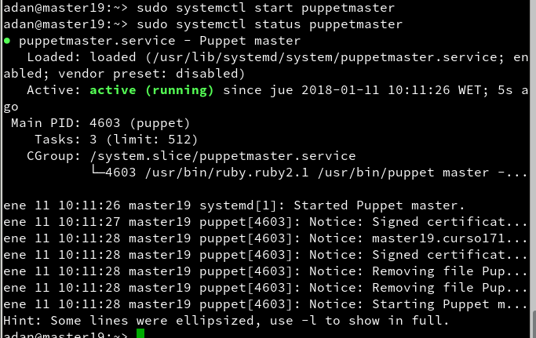

* Preparamos los ficheros/directorios en el master:
```
mkdir /etc/puppet/files
touch /etc/puppet/files/readme.txt
mkdir /etc/puppet/manifests
touch /etc/puppet/manifests/site.pp
mkdir /etc/puppet/manifests/classes
touch /etc/puppet/manifests/classes/hostlinux1.pp
```


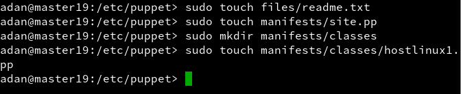


---

## site.pp

* Contenido de nuestro site.pp:


## hostlinux1.pp

* Contenido para /etc/puppet/manifests/classes/hostlinux1.pp:


* tree /etc/puppet, consultar los ficheros/directorios que tenemos creado.


* Comprobar que la ruta /var/lib/puppet tiene usuario/grupo propietario puppet.


* Reiniciamos el servicio systemctl restart puppetmaster.

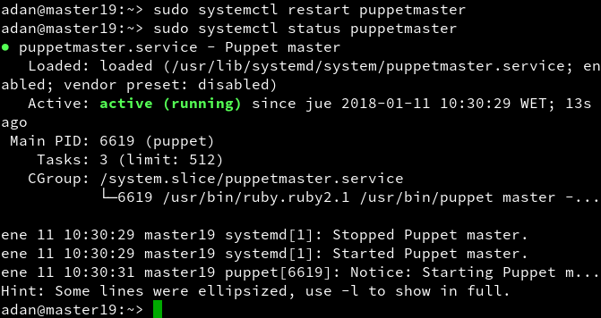

* Comprobamos que el servicio está en ejecución de forma correcta.
  * systemctl status puppetmaster
  * netstat -ntap |grep ruby

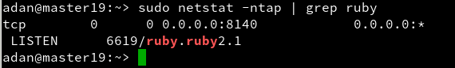

* Abrir el cortafuegos para el servicio.

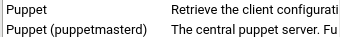

---

## Instalación y configuración del cliente1

* Vamos a la MV cliente 1.
* Instalar el Agente Puppet `zypper install rubygem-puppet`


* El cliente puppet debe ser informado de quien será su master. Para ello, vamos a configurar `/etc/puppet/puppet.conf`:


* Comprobar que la ruta /var/lib/puppet tiene como usuario/grupo propietario puppet.


* `systemctl status puppet`: Ver el estado del servicio puppet.

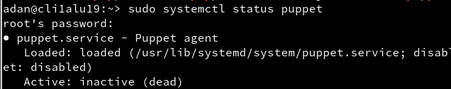

* `systemctl enable puppet`: Activar el servicio en cada reinicio de la máquina.


* `systemctl start puppet`: Iniciar el servicio puppet.
* `systemctl status puppet`: Ver el estado del servicio puppet.


* `netstat -ntap |grep ruby`: Muestra los servicios conectados a cada puerto.


---

## Certificados

* Vamos a la MV master.
* Nos aseguramos de que somos el usuario root.
* `puppet cert list`, consultamos las peticiones pendientes de unión al master:


* `puppet cert sign "cli1alu19.curso1718"`, aceptar al nuevo cliente desde el master:

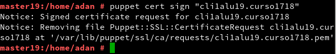

* `puppet cert print cli1alu42.curso1617`, mostramos el certificado.


# Comprobación

* Vamos a cliente1
* Reiniciamos la máquina y/o el servicio Puppet.


* Comprobar que los cambios configurados en Puppet se han realizado.
* Nos aseguramos de que somos el usuario root.
* Ejecutar comando para comprobar posibles errores:
  * `puppet agent --test`
        o también `puppet agent --server master42.curso1718 --test`

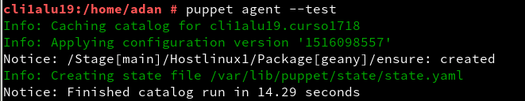

* En caso de tener errores:
  * Para ver el detalle de los errores, podemos reiniciar el servicio puppet en el cliente, y consultar el archivo de log del cliente: `tail /var/log/puppet/puppet.log`.
  * Puede ser que tengamos algún mensaje de error de configuración del fichero `/etc/puppet/manifests/site.pp` del master. En tal caso, ir a los ficheros del master y corregir los errores de sintáxis.

---

##  Segunda versión del fichero pp

* Contenido para /etc/puppet/manifests/classes/hostlinux2.pp:

```
class hostlinux2 {
  package { "tree": ensure => installed }
  package { "traceroute": ensure => installed }
  package { "geany": ensure => installed }

  group { "piratas": ensure => "present", }
  group { "admin": ensure => "present", }

  user { 'barbaroja':
    home => '/home/barbaroja',
    shell => '/bin/bash',
    password => 'poner-una-clave-encriptada',
    groups => ['piratas','admin','root']
  }

  file { "/home/barbaroja":
    ensure => "directory",
    owner => "barbaroja",
    group => "piratas",
    mode => 750
  }

  file { "/home/barbaroja/share":
    ensure => "directory",
    owner => "barbaroja",
    group => "piratas",
    mode => 750
  }

  file { "/home/barbaroja/share/private":
    ensure => "directory",
    owner => "barbaroja",
    group => "piratas",
    mode => 700
  }

  file { "/home/barbaroja/share/public":
    ensure => "directory",
    owner => "barbaroja",
    group => "piratas",
    mode => 755
  }
}
```

* Modificar `/etc/puppet/manifests/site.pp` para que se use la configuración de hostlinux2 el lugar de la anterior:

```
import "classes/*"

node default {
  include hostlinux2
}
```

* Ejecutar tree /etc/puppet en el servidor, para comprobar ficheros y directorios.


* Vamos al cliente1 y comprobamos que se hayan aplicado los cambios solicitados.


---

# Cliente puppet Windows

* Vamos a la MV master.
* Vamos a crear una configuración puppet para las máquinas windows, dentro del fichero.
* Crear /etc/puppet/manifests/classes/hostwindows3.pp, con el siguiente contenido:

```
class hostwindows3 {
  file {'C:\warning.txt':
    ensure => 'present',
    content => "Hola Mundo Puppet!",
  }
}
```


* Ahora vamos a modificar el fichero site.pp del master, para que tenga en cuenta la configuración de clientes GNU/Linux y clientes Windows, de modo diferenciado:

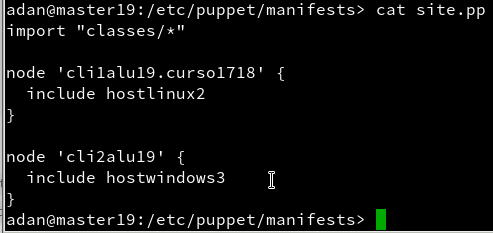

* En el servidor ejecutamos tree /etc/puppet, para confirmar que tenemos los nuevos archivos.


* Reiniciamos el servicio PuppetMaster.


* Debemos instalar la misma versión de puppet en master y en los clientes.


* Descargamos e instalamos la versión de Agente Puppet para Windows similar al Puppet Master.

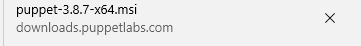

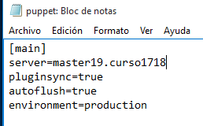

* Debemos aceptar el certificado en el master para este nuevo cliente. Consultar apartado anterior y repetir los pasos para este nuevo cliente.

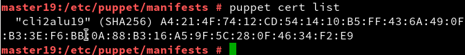


* Vamos al cliente2.

* Iniciar consola puppet como administrador y probar los comandos:
  * puppet agent --configprint server, debe mostrar el nombre del servidor puppet. En nuestro ejemplo debe ser masterXX.curso1718.

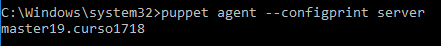

  * puppet agent --server masterXX.curso1617 --test: Comprobar el estado del agente puppet.

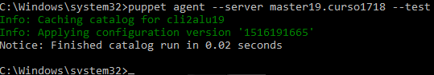

  * puppet agent -t --debug --verbose: Comprobar el estado del agente puppet.

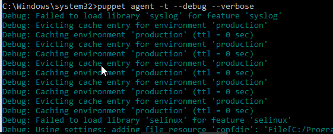

  * facter: Para consultar datos de la máquina windows, como por ejemplo la versión de puppet del cliente.

  


  * puppet resource user nombre-alumno1: Para ver la configuración puppet del usuario.

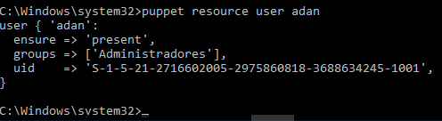

  * puppet resource file c:\Users: Para var la configuración puppet de la carpeta.

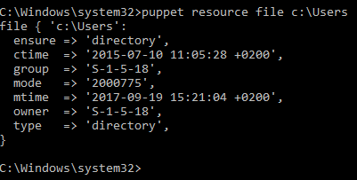

* Configuramos en el master el fichero `/etc/puppet/manifests/classes/hostwindows4.pp` para el cliente Windows:

```
class hostwindows4 {
  user { 'soldado1':
    ensure => 'present',
    groups => ['Administradores'],
  }

  user { 'aldeano1':
    ensure => 'present',
    groups => ['Usuarios'],
  }
}
```


* Crear un nuevo fichero de configuración para la máquina cliente Windows con el  nombre`/etc/puppet/manifests/classes/hostalumno5.pp`.
Incluir configuraciones elegidas por el alumno y probarlas.


## Comprobación


---
