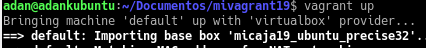

# Vagrant y VirtualBox.

---

## Instalar

* En la máquina real, instalamos el servicio vagrant utilizando el comando `sudo apt install vagrant`.


* `vagrant version`, para comprobar la versión actual de Vagrant.


* `VBoxManage -v`, para comprobar la versión actual de VirtualBox.


## Proyecto

* Crear un directorio para nuestro proyecto vagrant, para ello creamos una carpeta con un nombre cualquiera.


* Y utilizamos, dentro de esa carpeta, el comando `vagrant init`.


## Imágen, caja o box

* Ahora necesitamos obtener una imagen(caja, box) de un sistema operativo. Vamos, por ejemplo, a conseguir una imagen de un Ubuntu Precise de 32 bits.
  * Utilizamos el comando `vagrant box add micaja19_ubuntu_precise32 http://files.vagrantup.com/precise32.box`.


* Comprobamos que se ha creado la caja con el comando `vagrant box list`.


* Cambiamos la línea `config.vm.box = "base" por config.vm.box = "micaja19_ubuntu"`


## Iniciar una máquina nueva

* Vamos a la carpeta de nuestro proyecto, y utilizamos el comando `vagrant up` para iniciar nuestra máquina.


> `Vagrant ssh` para conectarnos a la máquina remotamente.


---

# Configuración del entorno virtual

## Carpetas compartidas

* Para identificar las carpetas compartidas dentro del entorno virtual, primero iniciamos la máquina, nos conectamos por remoto, y hacemos un `ls /vagrant`.


## Redireccionamiento de puertos

* Conectados vía ssh a la máquina, hacemos un `apt update` para actualizar los repositorios.


* Instalamos el apache2 usando `apt -y install apache2`.


* Modificar el fichero Vagrantfile, de modo que el puerto 4567 del sistema anfitrión sea enrutado al puerto 80 del ambiente virtualizado.


* `vagrant reload` para refrescar.


* Comprobamos que escucha por ese puerto haciendo un `nmap -p 4500-4600 localhost`.


* Debe mostrar lo siguiente:


* En la máquina real, abrimos el navegador web con el URL http://127.0.0.1:4567. En realidad estamos accediendo al puerto 80 de nuestro sistema virtualizado.


# Suministro

* `vagrant halt`, apagamos la MV.


* `vagrant destroy` y la destruimos para volver a empezar.


## Suministro mediante shell script

* Crear el script install_apache.sh, dentro del proyecto con el siguiente contenido:

```console
#!/usr/bin/env bash

apt-get update
apt-get install -y apache2
rm -rf /var/www
ln -fs /vagrant /var/www
echo "<h1>Actividad de Vagrant</h1>" > /var/www/index.html
echo "<p>Curso201516</p>" >> /var/www/index.html
echo "<p>Nombre-del-alumno</p>" >> /var/www/index.html
```


* Modificar Vagrantfile y agregar la siguiente línea a la configuración: config.vm.provision :shell, :path => "install_apache.sh"


* Volvemos a crear la máquina.



* Para verificar que efectivamente el servidor Apache ha sido instalado e iniciado, abrimos navegador en la máquina real con URL http://127.0.0.1:4567.


## Suministro mediante Puppet

* Modificar el archivo el archivo Vagrantfile de la siguiente forma:

```console
Vagrant.configure(2) do |config|
  ...
  config.vm.provision "puppet" do |puppet|
    puppet.manifest_file = "default.pp"
  end
 end
```

* Crear un fichero manifests/default.pp, con las órdenes/instrucciones puppet para instalar el programa nmap. Ejemplo:


* Recargamos vagrant


# Nuestra caja personalizada

## Preparar la MV VirtualBox

* Crear una MV VirtualBox nueva o usar una que ya tengamos.
* Instalar OpenSSH Server en la MV.
* Crear el usuario vagrant, para poder acceder a la máquina virtual por SSH. A este usuario le agregamos una clave pública para autorizar el acceso sin clave desde Vagrant.


* Poner clave vagrant al usuario vagrant y al usuario root.


* Añadir vagrant ALL=(ALL) NOPASSWD: ALL a /etc/sudoers.


* Debemos asegurarnos que tenemos instalado las VirtualBox Guest Additions con una versión compatible con el host anfitrion.


## Crear la caja vagrant

* Vamos a crear una nueva carpeta mivagrantXXconmicaja, para este nuevo proyecto vagrant.
  * Ejecutamos vagrant init para crear el fichero de configuración nuevo.


* Localizar el nombre de nuestra máquina VirtualBox (Por ejemplo, v1-opensuse132-xfce).
  * VBoxManage list vms, comando de VirtualBox que lista las MV que tenemos.
    * Crear la caja package.box a partir de la MV.


* Muestro la lista de cajas disponibles, pero sólo tengo 1 porque todavía no he incluido la que acabo de crear. Finalmente, añado la nueva caja creada por mí al repositorio de vagrant.


* Pero haciendo vagrant ssh nos conectamos sin problemas con la máquina.

---
