# Docker

---

## Requisitos

* Vamos a usar MV OpenSUSE. Nos aseguraremos que tiene una versión del Kernel 3.10 o superior (uname -a).

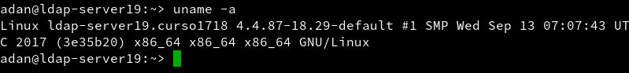

# Instalación y primeras pruebas.

* Instalamos docker: `sudo apt-get install -y docker` o `zypper in docker`.


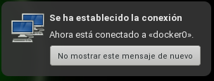

* Iniciamos el servicio docker: `systemctl start docker`.

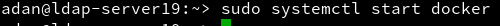

* Utilizamos el comando `docker version` para que nos muestre la version instalada.

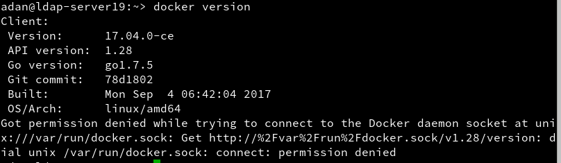

* Añadimos permisos a nuestro usuario: `usermod -a -G docker <usuario>`.


* Mostramos otra vez la versión docker:

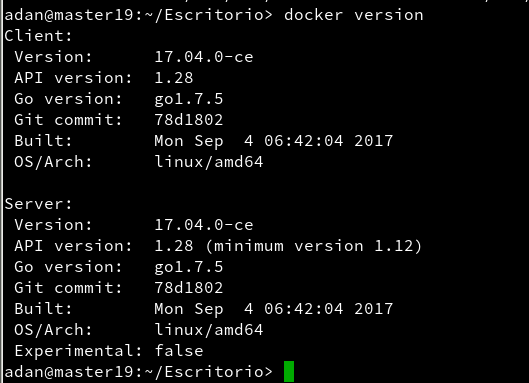

* Salimos de nuestra sesión y volvemos a entrar, o bien reiniciamos, para que cargue la configuración.

* Comprobamos que todo funciona con los siguientes comandos ->

* `docker images`: Muestra las imágenes descargadas.

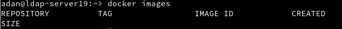

* `docker ps -a`: Muestra todos los contenedores creados.

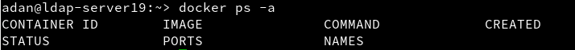

* `docker run hello-world`: Descarga y ejecuta un contenedor con la imagen hello-world.

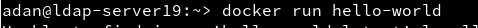

* `docker images`: Muestra la nueva imagen descargada.

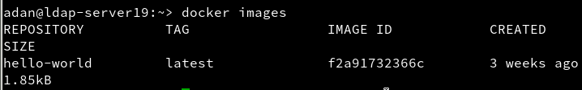

* `docker ps -a`: Muestra el contenedor en estado *exited*.

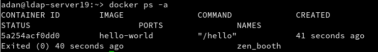

---

## Configuración de red.

* Si queremos que nuestro contenedor tenga acceso a la red exterior, debemos activar la opción IP_FORWARD (net.ipv4.ip_forward).
  * Para openSUSE13.2 (cuando el método de configuracion de red es Wicked). Yast -> Dispositivos de red -> Encaminamiento -> Habilitar reenvío IPv4
  * Cuando la red está gestionada por Network Manager, en lugar de usar YaST debemos editar el fichero /etc/sysconfig/SuSEfirewall2 y poner FW_ROUTE="yes".

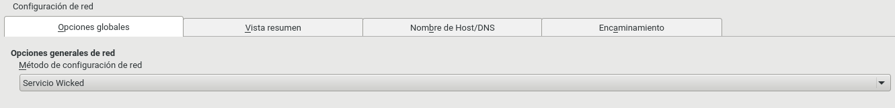

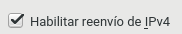

---

## Creación manual

* `docker images`: Vemos nuestras imágenes.

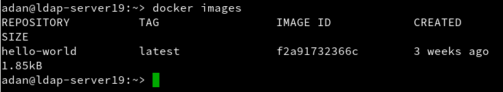

* `docker search debian`: Buscamos *debian* en los repositorios de Docker Hub.

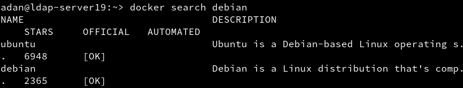

* `docker pull debian:8`: Descargamos la imagen *debian:8* en local.

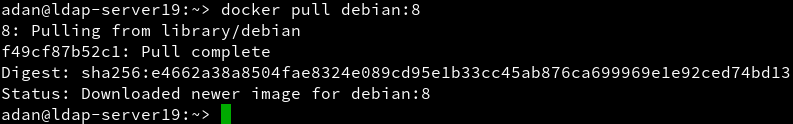

* `docker images`: Comprobamos que se descargó.

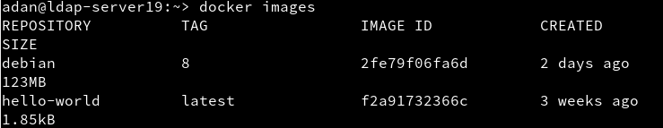

* `docker ps -a`: Vemos nuestros contenedores.
* `docker ps`: Vemos los contenedores en ejecución.

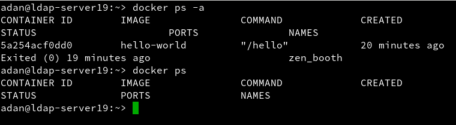

* Vamos a crear un contenedor con nombre mv_debian a partir de la imagen debian:8, y ejecutaremos /bin/bash: `docker run --name=mv_debian -i -t debian:8 /bin/bash`.

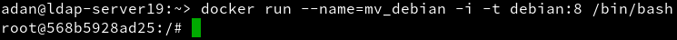

* Estamos dentro del contenedor.
  * Comprobamos que estamos en debian.

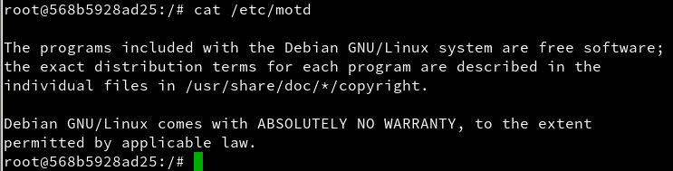

* Actualizamos los repositorios.

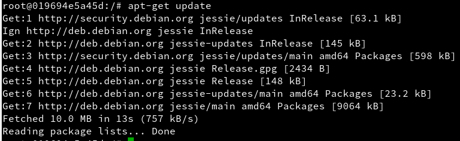

* Instalamos una aplicación, en nuestro caso, **Nginx**.

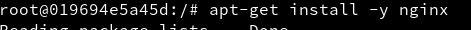

* Instalamos también el editor de texto **vi**.


* Iniciamos el servicio Nginx dentro del contenedor.


* Comprobamos los procesos.

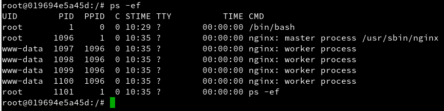

* Creamos un fichero *html* que mostrará la página web.

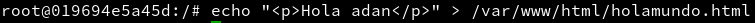

* Creamos también un script con el siguiente contenido:

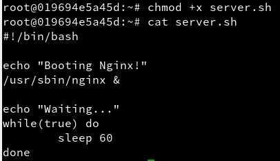

* Comprobamos que tenemos la máquina funcionando.

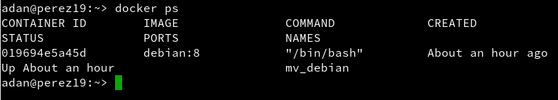

* Ahora con esto podemos crear la nueva imagen a partir de los cambios que realizamos sobre la imagen base:
  * `docker commit <CONTAINER ID> <nombre>`
  * `docker images`: Comprobamos que se creó correctamente.

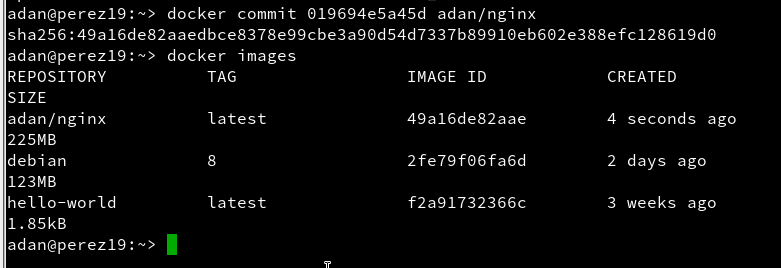

```
docker ps
docker stop con_debian  # Paramos el contenedor
docker ps
docker ps -a           # Vemos el contenedor parado
docker rm IDcontenedor # Eliminamos el contenedor
docker ps -a
```

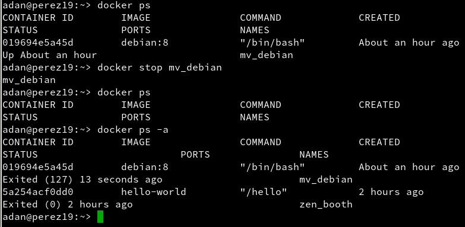

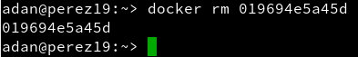

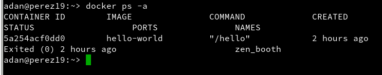

---

## Crear contenedor Nginx.

* Iniciemos el contenedor de la siguiente manera:
```
docker ps
docker ps -a
docker run --name=con_nginx -p 80 -t dvarrui/nginx /root/server.sh
Booting Nginx!
Waiting...
```

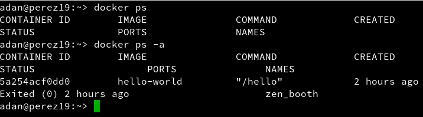

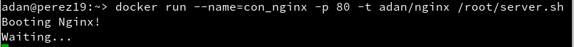

* `docker ps`: Nos muestra los contenedores en ejecución. Podemos apreciar que la última columna nos indica que el puerto 80 del contenedor está redireccionado a un puerto local 0.0.0.0.:NNNNNN->80/tcp.

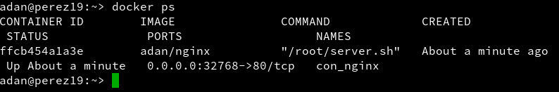

* Abrir navegador web y poner URL 0.0.0.0.:NNNNNN. De esta forma nos conectaremos con el servidor Nginx que se está ejecutando dentro del contenedor.

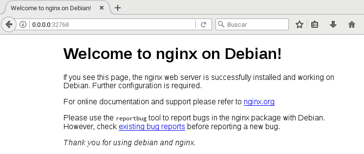

* Paramos el contenedor y lo eliminamos.

```
docker ps
docker stop con_nginx
docker ps
docker ps -a
docker rm con_nginx
docker ps -a
```

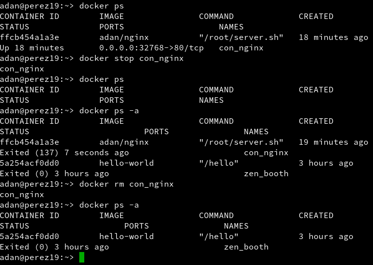

---

## Crear un contenedor con Dockerfile

* Comprobaciones iniciales:

```
docker images
docker ps
docker ps -a
```


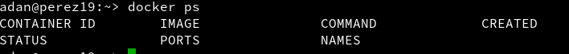

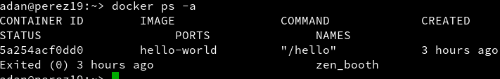

* Crear directorio /home/nombre-alumno/dockerXX, poner dentro los siguientes ficheros:
  * Dockerfile
  * holamundo.html
  * server.sh


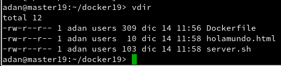

* Crear el fichero **Dockerfile** con el siguiente contenido:
```
FROM debian:8

MAINTAINER Nombre-del-Alumno 1.0

RUN apt-get update
RUN apt-get install -y apt-utils
RUN apt-get install -y nginx
RUN apt-get install -y vim

COPY holamundo.html /var/www/html
RUN chmod 666 /var/www/html/holamundo.html

COPY server.sh /root
RUN chmod +x /root/server.sh

EXPOSE 80

CMD ["/root/server.sh"]
```

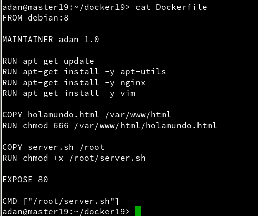

* `docker images`: Consultamos las imágenes disponibles.

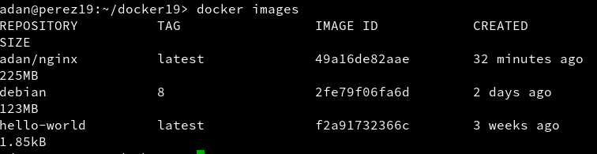

* `docker build -t adan/nginx2 .`: Construimos la imagen a partir del Dockerfile


* `docker ps -a`: Comprobamos.

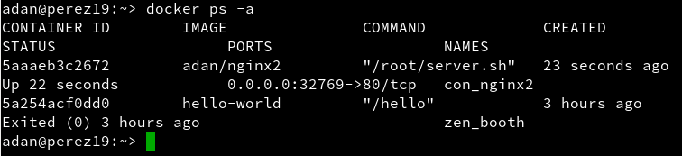

* A continuación vamos a crear un contenedor con el nombre con_nginx2, a partir de la imagen adan/nginx2, y queremos que este contenedor ejecute el programa /root/server.sh.
  * `docker run --name con_nginx2 -p 80 -t dvarrui/nginx2 /root/server.sh`

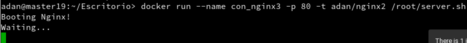

* Comprobar en el navegador URL: http://localhost:PORTNUMBER

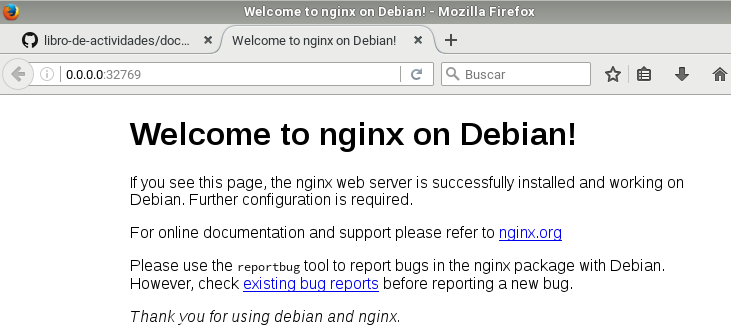

* Comprobar en el navegador URL: http://localhost:PORTNUMBER/holamundo.html

* El PORTNUMBER lo averigüamos con el comando `docker ps -a`


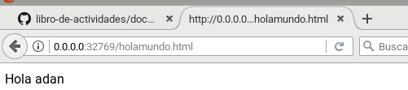

---

## Migrar las imágenes de docker a otro servidor

* `docker ps`, muestra los contenedores que tengo en ejecución.

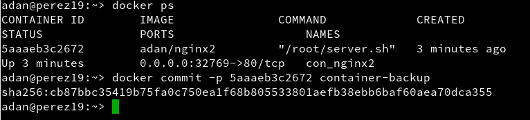

* `docker commit -p CONTAINERID container-backup`, grabar una imagen de nombre "container-backup" a partir del contenedor CONTAINERID.

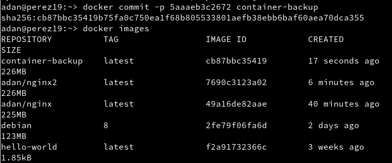

* Exportar imagen docker a fichero:
  * `docker save -o ~/containerXX-backup.tar containerXX-backup`, guardamos la imagen "container-backup" en un fichero tar.


* Cargamos la imagen que me pasó Sergio para comprobar que funcionan en otro servidor.
  * `docker load -i ~/<nombre-imagen>`

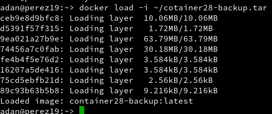

* `docker images`

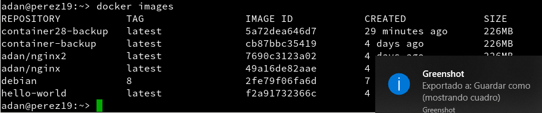

---
