# Servidor LDAP.

---

## Preparar máquina.

* Configuramos el fichero `/etc/hosts` para añadir el cliente.
  * También modificamos el fichero `/etc/hostname` para poner un nuevo nombre de máquina.
    * Tenemos que reiniciar la máquina para que se modifique el *hostname*, yo la reinicié más adelante.

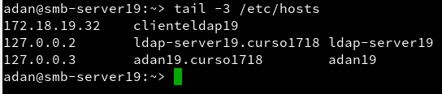

---

## Instalación del Servidor LDAP.

* Instalamos el módulo Yast que gestiona el servidor LDAP.

* Vamos a **Yast -> Servidor de autenticación**, y lo configuramos de esta forma:
  * Iniciar servidor LDAP -> Sí
  * Registrar dameon SLP -> No
  * Puerto abierto en el cortafuegos -> Sí -> Siguiente
  * Tipo de servidor -> autónomo -> Siguiente
  * Configuración TLS -> NO habilitar -> Siguiente
  * Tipo de BD -> hdb
  * DN base -> dc=nombre-del-alumnoXX,dc=curso1718. Donde XX es   el  número del puesto de cada uno.
  * DN administrador -> cn=Administrator
  * Añadir DN base -> Sí
  * Contraseña del administrador
  * Directorio de BD -> /var/lib/ldap
  * Usar esta BD predeterminada para clientes LDAP -> Sí -> Siguiente
  * Habilitar kerberos -> No

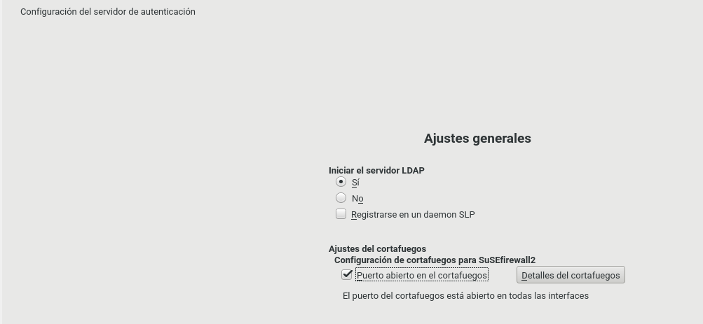

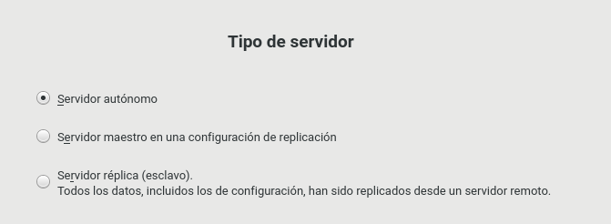

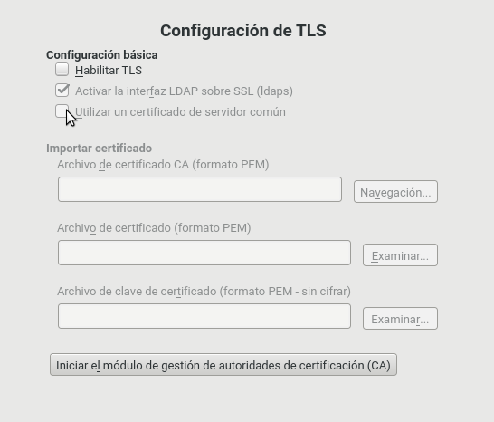

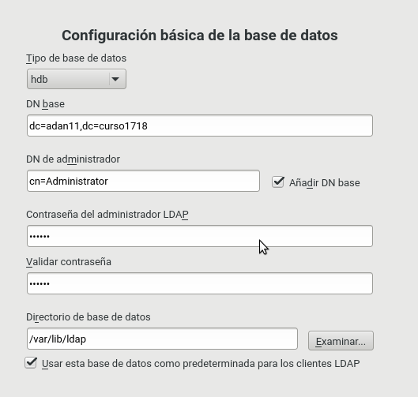

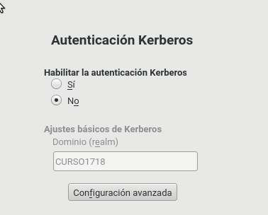

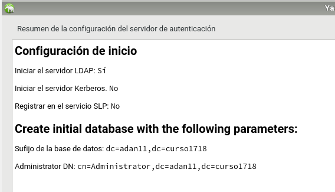

* Comprobamos con los siguientes comandos:
  * `slaptest -f /etc/openldap/slapd.conf`
  * `systemctl status slapd`
  * `nmap -Pn localhost | grep -P '389|636'`
  * `sudo slapcat`
  * `gq`

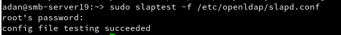

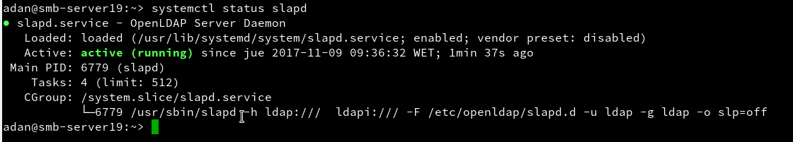

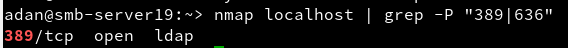

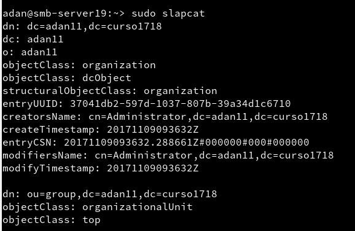

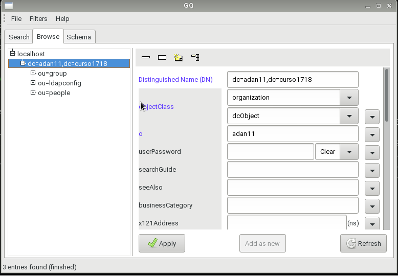

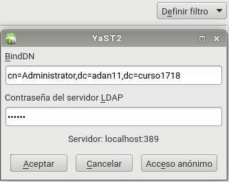

---

## Crear usuarios y grupos LDAP.

* Vamos a **Yast -> Usuarios y Grupos** y aplicamos el filtro *LDAP*.
  * Creamos el grupo `piratas22`.
  * Creamos los usuarios `pirata21` y `piratas22` dentro del grupo `piratas22`.

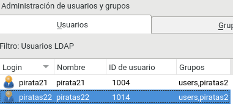

* Utilizamos la herramienta `gq` para comprobar el contenido de LDAP.

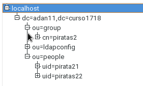

---

## Cliente LDAP.

* Configuramos el archivo `/etc/hosts` para añadir al servidor.

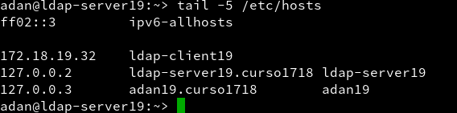

* Comprobamos la conexión utilizando un `nmap`.

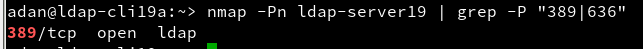

* Utilizamos la herramienta `gq` para comprobar los usuarios.

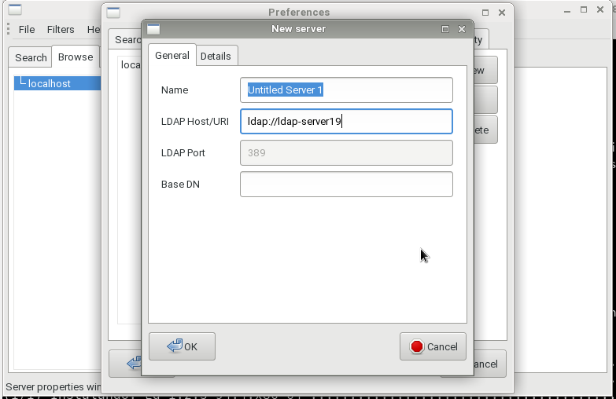

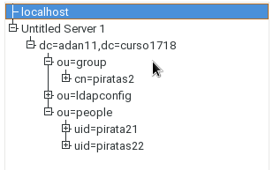

## Instalar cliente LDAP.

* Instalamos el paquete `yast2-auth-client`.
  * Y vamos a **Yast -> LDAP y cliente Kerberos**.
  * Configuramos como la imagen y probamos la conexión.

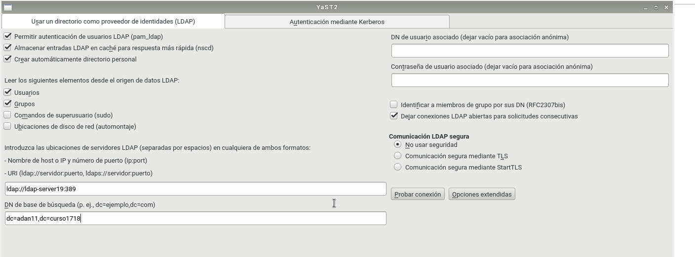

* Comprobamos con los siguientes comandos:
  * `getent passwd pirata21`
  * `getent group piratas2`
  * `id pirata21`
  * `finger pirata21`
  * `cat /etc/passwd | grep pirata21`
  * `cat /etc/group | grep piratas2`
  * `su pirata21`

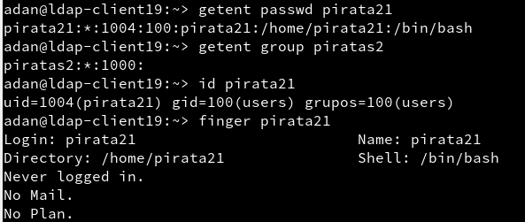

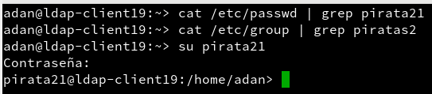

## Autenticación.

* En el cliente, cerramos sesión con el usuario en el que estemos, y iniciamos otra sesión con el usuario pirata22 (aunque en la captura salga piratas21, no entré con ese usuario ya que me daba un error, yo entré con piratas22, y luego me di cuenta que el error era porque el usuario pirata21 es en singular) y su respectiva contraseña.

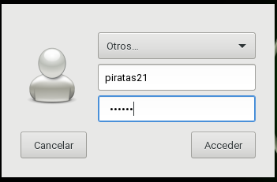

* Y si todo ha ido correctamente ya estaríamos dentro.

---
