# Acceso remoto **SSH** :octocat:

# Configuración

* Lo primero es tener 3 máquinas.
  1. Máquina *servidor*.
      - Con OpenSuse, IP `172.18.19.31`, y hostname `ssh-server19`.
  2.  Máquina *cliente 1*.
      - Con OpenSuse, IP `172.18.19.32`, y hostname `ssh-client19a`.
  3.  Máquina *cliente 2*.
      - Con Windows, IP `172.18.19.11`, y hostname `ssh-client19b`.

  

* En la máquina *servidor*, nos dirigimos a `/etc/hosts`, modificamos el archivo introduciendo las 3 máquinas, con sus IPs y sus respectivos hostnames.

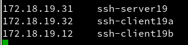

* Hacemos pequeñas comprobaciones con los siguientes comandos:
>ip a
>
>sudo route -n
>
>ping 172.18.19.32 (*Máquina cliente1*)
>
>ping ssh-client19a
>
>lsblk
>
>sudo blkid

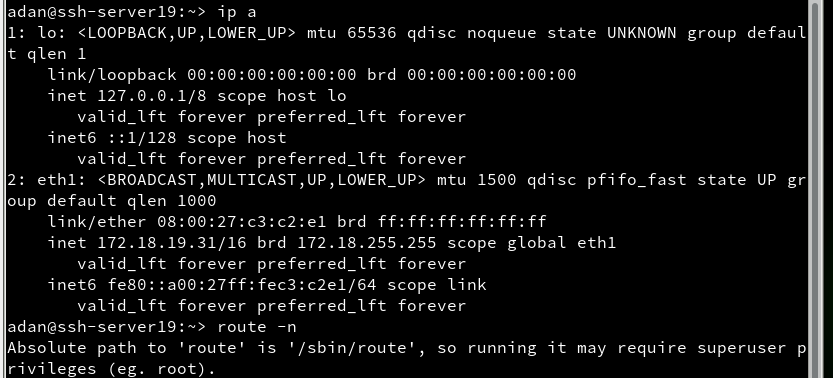

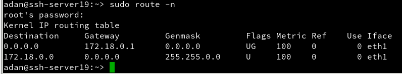

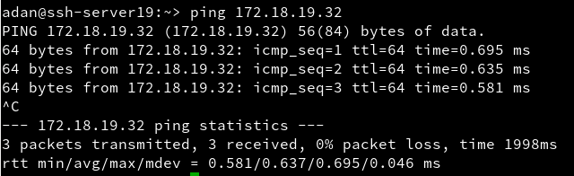

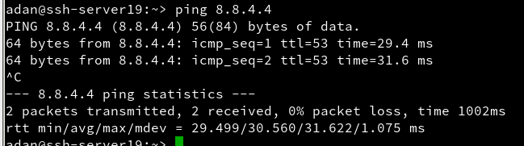

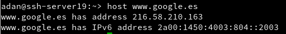

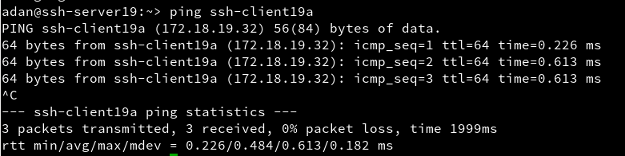

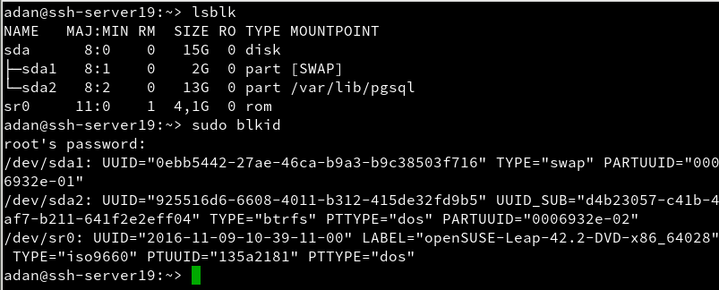

* Creamos usuarios *(en la máquina servidor)*, con los cuales nos conectaremos remotamente via ssh.
  * Utilizar el comando `sudo useradd -m perez1`, y luego, `sudo passwd perez1` para asignarle contraseña.

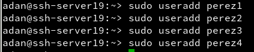

* Vamos ahora a la **máquina cliente 1** para añadir en `etc/hosts` a la máquina servidor y cliente 2.

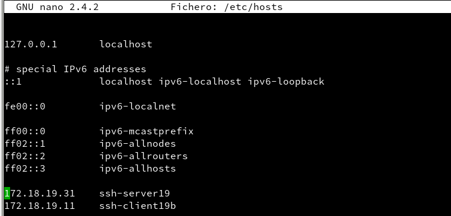

* Comprobamos que está bien haciendo un ping a la máquina servidor.

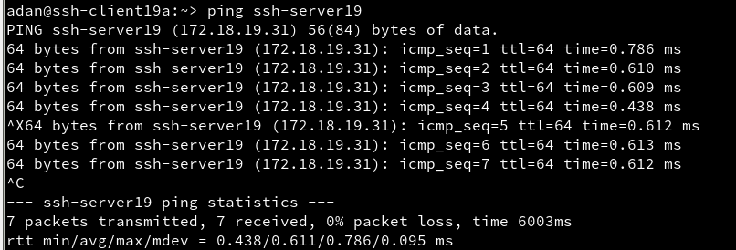

* Ahora en la máquina cliente 2, iremos a descargar el programa `putty`, con el que haremos la conexión remota.

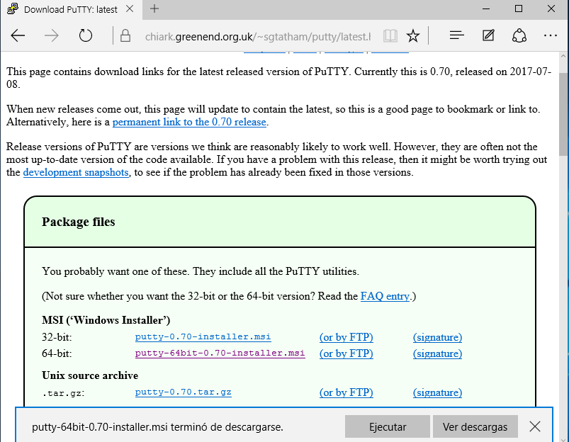

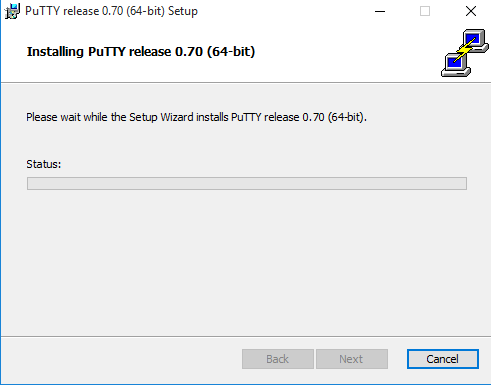

* Y cambiamos su nombre de equipo, a su correspondiente, y su grupo de trabajo.

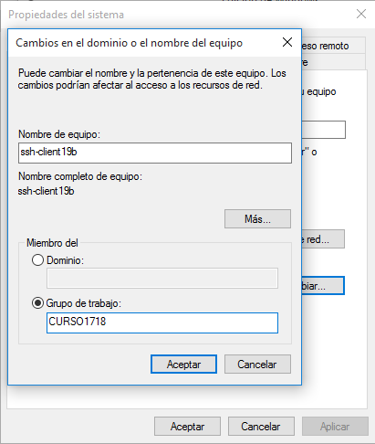

* Nos dirigimos a la ruta `C:\Windows\System32\drivers\etc\hosts` y ahí añadimos a la máquina servidor y cliente 1.

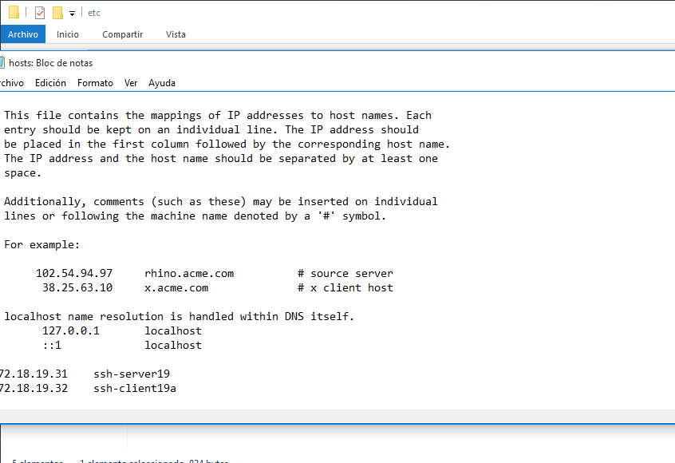

* Volvemos a comprobar con un *ping*.

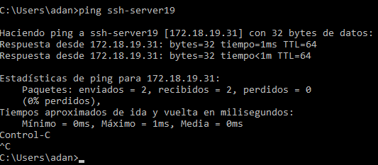

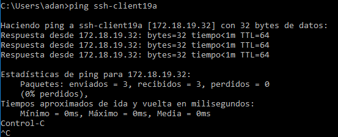

# Conexión

* Volvemos a la máquina servidor e instalamos openssh con el comando `sudo zypper install openssh`.
  * En mi caso ya está instalado.

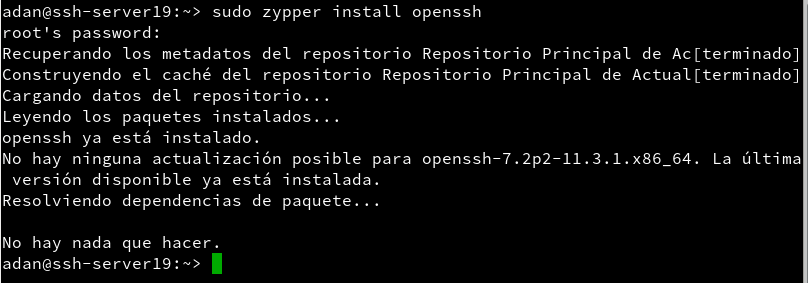

* Comprobamos el *status* del servicio, y está inactivo.

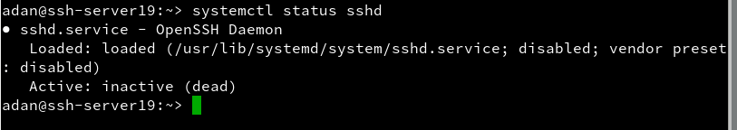

* Entonces lo activamos.
  * `sudo systemctl start sshd`
    - Y volvemos a comprobar.

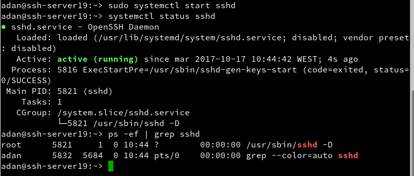

* Con `netstat -ntap` comprobamos que el servicio sshd escucha el puerto 22,

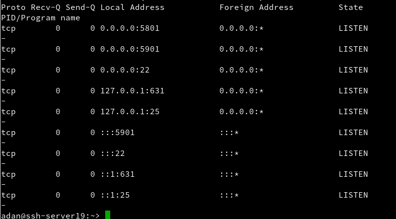

* Autorizamos a dicho servicio en el *cortafuegos*.

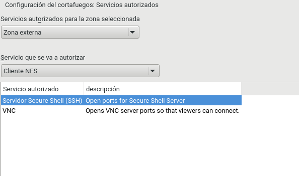

* Vemos que la máquina servidor está con el servicio ssh activa en el puerto 22, lo comprobamos desde la máquina cliente con el comando `nmap -Pn ssh-server19`.

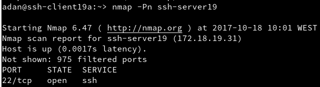

* Instalamos el servicio ssh en el cliente también, y probamos la primera conexión **cliente-servidor**.
  * `ssh usuario@máquina`
    * `ssh perez11@ssh-server19`

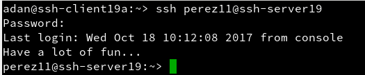

* Con un `ll .ssh/` comprobamos que se ha creado un nuevo documento, el cual contiene una contraseña de acceso.

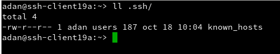

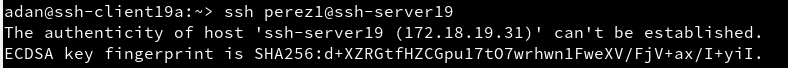

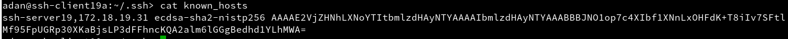

* Comprobamos ahora desde Windows.
  * Introducimos el nombre del servidor.

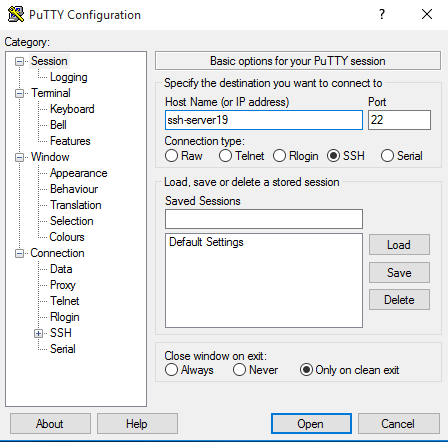

* Nos da el *key fingerprint* y pulsamos *Sí*.

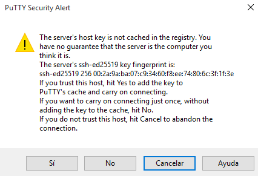

* Introducimos el usuario, y luego, su contraseña.
  * Y ya estamos dentro del servidor.

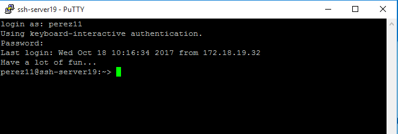

# Cambiamos las claves del servidor.

* En el *servidor* comprobamos que tenemos creadas varias contraseñas de ssh, tanto públicas como privadas.

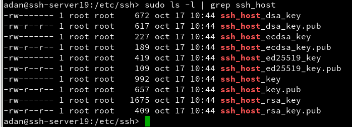

* Modificamos el archivo `/etc/ssh/sshd_config` y descomentamos la línea `HostKey /etc/ssh/ssh_host_rsa_key`.

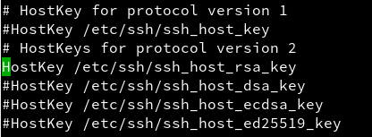

* Una vez hecho esto, generamos una *ssh-keygen* rsa.
  * `sudo ssh-keygen -t rsa -f /etc/ssh/ssh_host_rsa_key`

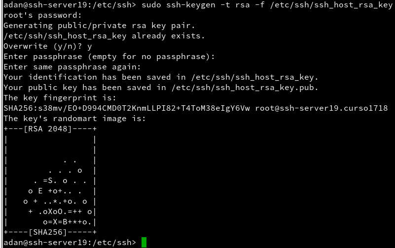

* Reiniciamos el servicio sshd.

* Comprobamos que el servicio sigue activo sin ningún problema.

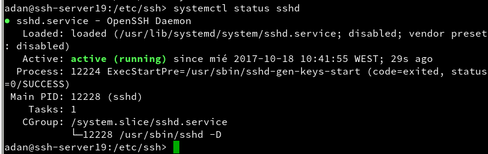

* Y ahora intentamos volver a conectarnos cliente>servidor.
  * Y como comprobamos, es imposible conectarnos, ya que hemos cambiado la *rsa key*.

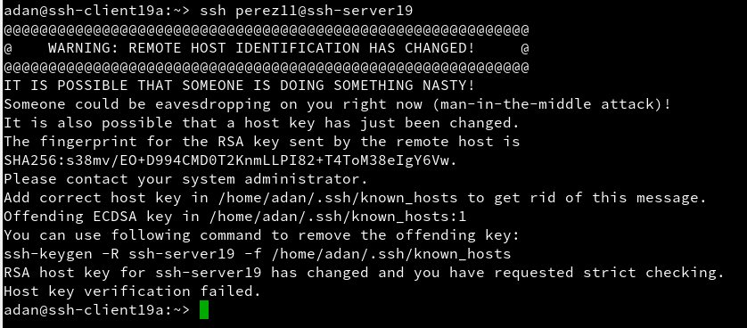

# Personalizar el prompt Bash y alias.

* En el servidor, nos dirigimos a `/home/perez11/.alias`
  * Introducimos los alias que queremos probar, en mi caso tenemos uno para el *Clear, Geany, Ping, vdir -cF1 y ssh*.

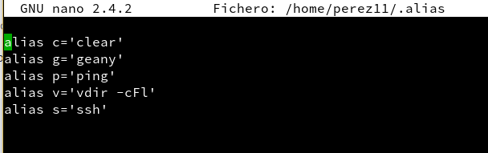

* Personalizamos nuestro **prompt** con un *script* que nos quedaría de la siguiente forma.

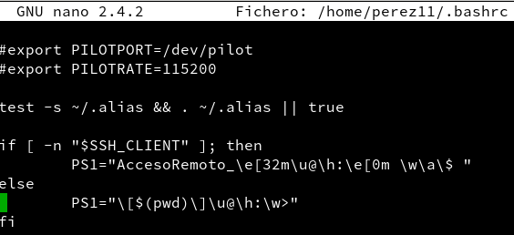

* Y ahora podemos comprobar que ha cambiado el prompt, si no ha cambiado, utilizamos un `source .bashrc` y luego comprobamos también los alias.

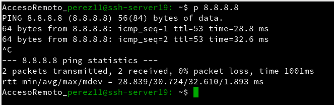

# Claves públicas.

* Iniciamos sesión con el usuario normal en el cliente.

* Generamos una *rsa key*.

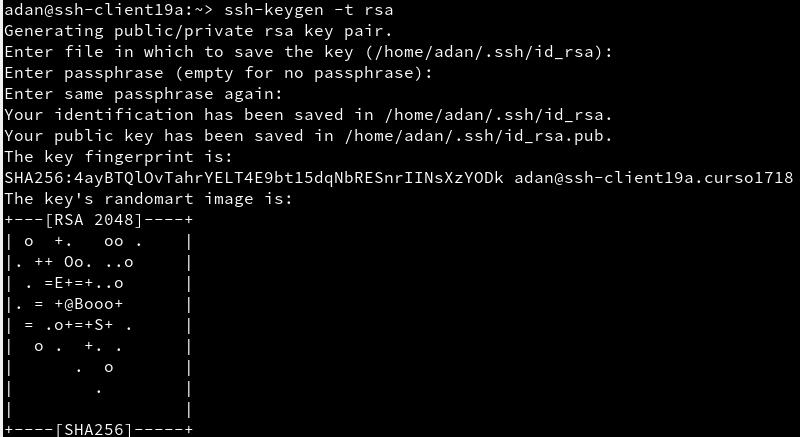

* Y copiamos dicha key hacia el servidor.
  * `ssh-copy-id perez44@ssh-server19`

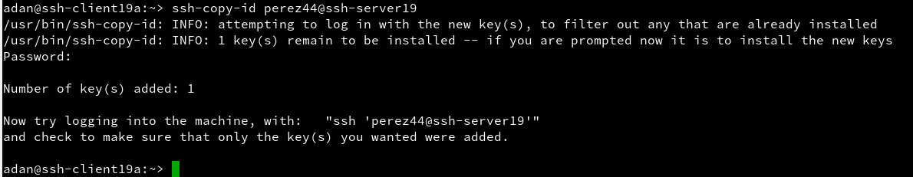

* Y ahora si entramos al usuario via ssh podemos *ver* que no nos pide ya la **contraseña** para entrar.

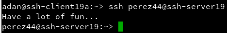

* Pero de hecho, desde el cliente de Windows sí, porque la clave la generamos desde el cliente A.

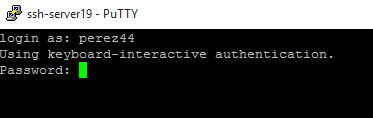

# SSH tunel para X

* Instalamos el **geany** en la máquina servidor.

* `/etc/ssh/sshd_config`

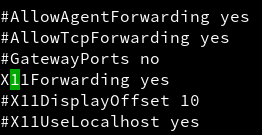

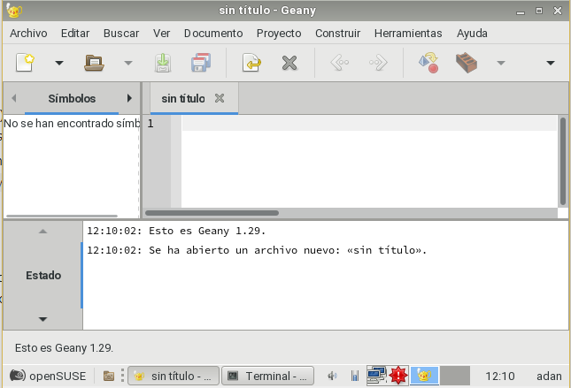

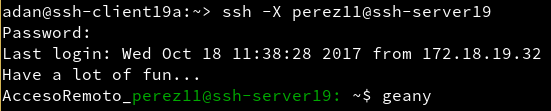

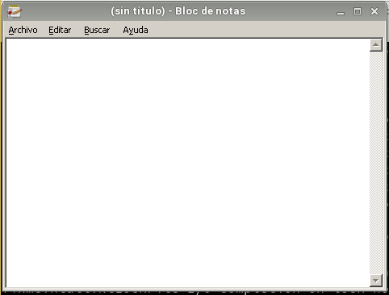

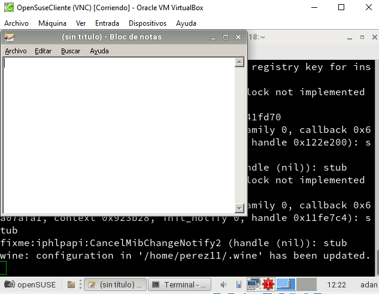

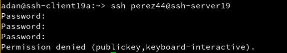

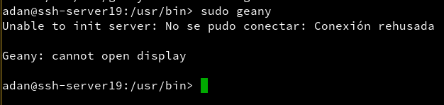

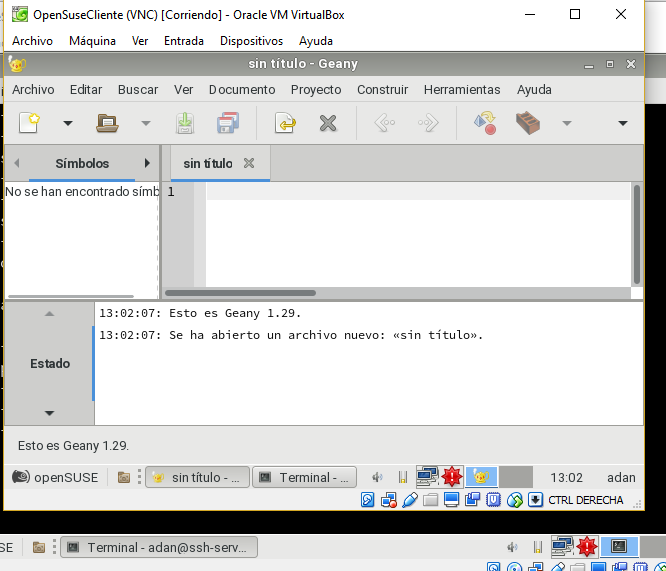
