# Samba

---

### Máquinas

* Vamos a necesitar 3 máquinas.
  * Una máquina OpenSuse que hará de servidor (172.18.19.31).
  * Una máquina OpenSuse que hará de cliente (172.18.19.32).
  * Una máquina Windows que hará de cliente (172.18.19.11).

---

### Comprobaciones

* Comprobamos que hemos configurado el servidor correctamente, utilizamos dichos comandos:
```console
hostname -f
ip a
lsblk
sudo blkid
```

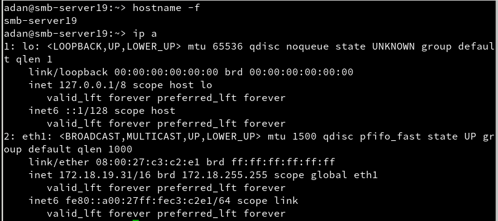

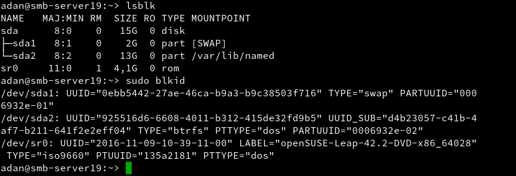

---

### Servidor

* Primero, creamos los grupos `piratas`, `soldados` y `todos`.

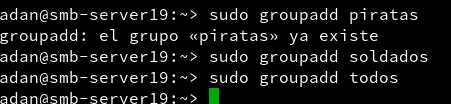

* Ahora creamos el usuario `smbguest` pero prohibimos su acceso en nuestra máquina mediante login.


* Nos vamos al fichero `/etc/passwd` y en la línea que corresponda al usuario, ponemos *`/bin/false/`*.

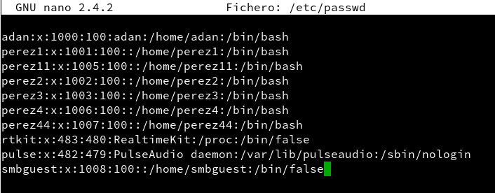

* Ahora creamos los usuarios `pirata1` y `pirata2` y los añadimos al grupo `piratas`.


* Creamos los usuarios `soldado1` y `soldado2` y los añadimos al grupo `soldados`.

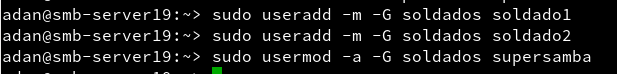

* Luego creamos el usuario `smbguest`, que estará en todos los grupos, y por último, creamos el grupo `todos` donde estarán todos los usuarios creados hasta el momento.

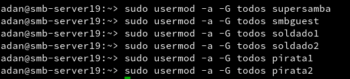

* Comprobamos que todo se ha creado correctamente con un `cat /etc/group`

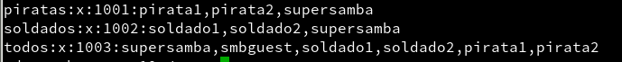

---

### Carpetas para los recursos compartidos

* Procedemos a crear unas carpetas donde compartiremos los recursos.
  * Nos dirigimos a `/srv` y creamos la carpeta **samba19**, y después vamos a `/srv/samba19` y creamos las carpetas:
    * `barco.d` con permisos **770**, usuario propietario *supersamba* y grupo propietario *piratas*.
    * `castillo.d` con permisos **770**, usuario propietario *supersamba* y grupo propietario *soldados*.
    * `public.d` con permisos **775**, usuario propietario *supersamba* y grupo propietario *todos*.

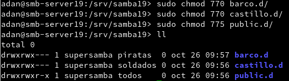

---

### Configurar Samba

* Hacemos una copia de seguridad de `etc/samba/smb.conf` por si tenemos cualquier problema.

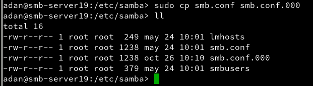

* Vamos a **Yast > Servidor Samba**.
  * De nombre de grupo de trabajo ponemos `mar1718`.
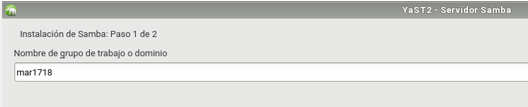

  * Sin controlador de dominio
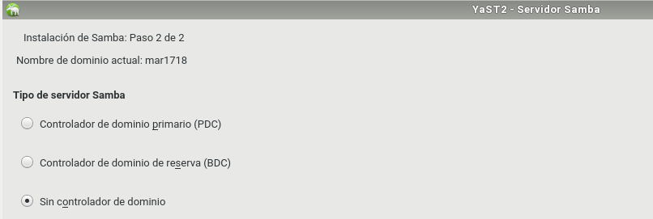

  * Inicio durante el arranque, puerto abierto del cortafuegos.
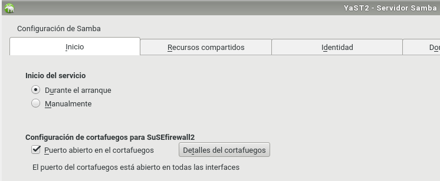

* Ahora vamos al archivo de configuración de samba `et/samba/smb.conf` e insertamos las siguientes líneas de comando:

```console
[global]
  netbios name = smb-server19
  workgroup = mar1617
  server string = Servidor de adan19
  security = user
  map to guest = bad user
  guest account = smbguest

[cdrom]
  path = /dev/cdrom
  guest ok = yes
  read only = yes

[public]
  path = /srv/samba19/public.d
  guest ok = yes
  read only = yes

[castillo]
  path = /srv/samba19/castillo.d
  read only = no
  valid users = @soldados

[barco]
  path = /srv/samba19/barco.d
  read only = no
  valid users = pirata1, pirata2
```

* Usamos `testparm` para comprobar resultados.

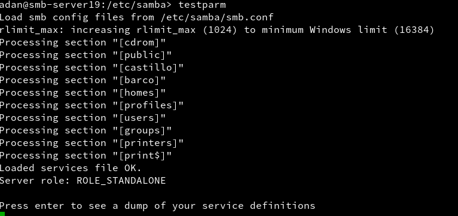

---

### Usuarios Samba

* Añadimos a los usuarios del sistema en el servidor Samba a la vez que ponemos sus respectivas contraseñas con el comando `smbpasswd -a nombreusuario`

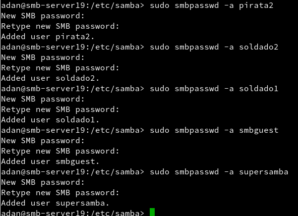

* Y comprobamos la lista con el comando `pdbedit -L`.

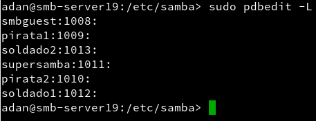

---

### Reiniciar sistema

* Reiniciamos el sistema y comprobamos el estado de los servicios `smb` y `nmb`.

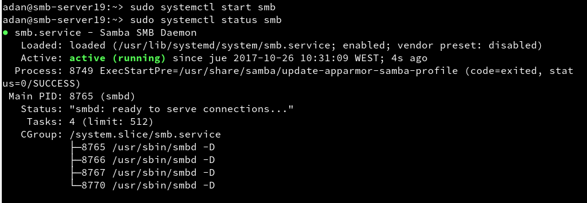

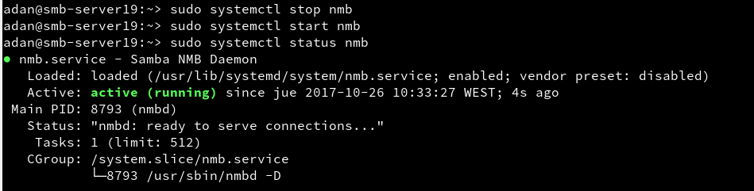

* `sudo testparm` > Verifica la sintaxis del fichero de configuración del servidor Samba

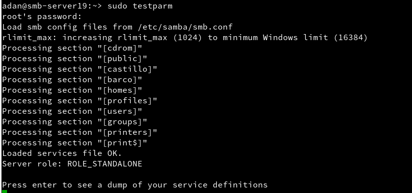

* `sudo netstat -tap` > Vemos que el servicio SMB/CIF está a la escucha


---
