# **Acceso remoto VNC**

# OpenSuse a OpenSuse

* Antes que nada, crearemos dos máquinas en VirtualBox, una **cliente** y otra **servidor** con *(por ejemplo)* 2048 GB de Ram, 15 GB de disco duro, la ISO de OpenSuse Leap, y adaptador puente.
  - Una vez instalada las máquinas, tenemos que configurar sus IPs.
  - La máquina **servidor** llevará la IP 172.18.19.31
  - La máquina **cliente** llevará la IP 172.18.19.32

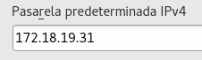

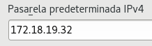

* Una vez hecho, vamos, en ambas máquinas, a *Yast > Administración remota* y configuramos el sistema **VNC**.

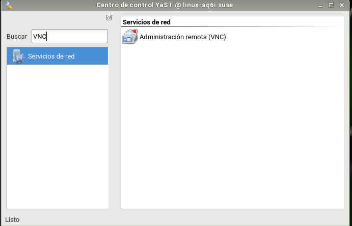

* Permitimos la administración remota.

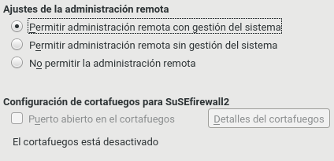

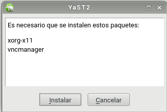

* En el Firewall, autorizamos el VNC.
  - Todo esto hay que hacerlo en ambas máquinas.

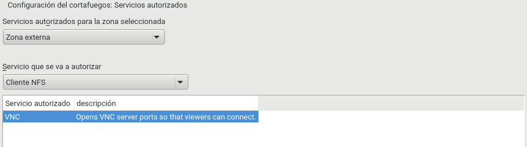

* Ahora solo en el **servidor** vamos a la terminal, y escribimos el comando *vncserver* e introducimos una contraseña de acceso.

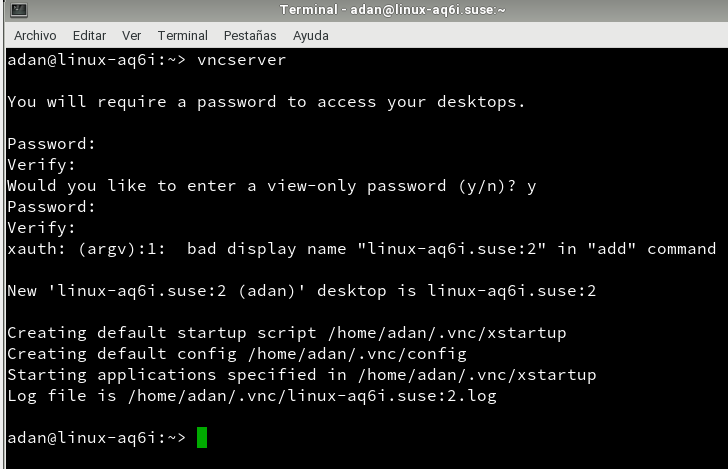

* Vamos al cliente, y escribimos *vncviewer* para entrar por control remoto, lo cual nos pedirá la IP del servidor, y al conectar, la contraseña anterior.

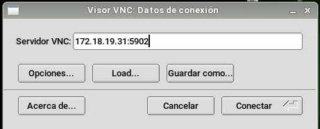

* Y ya estaríamos dentro.

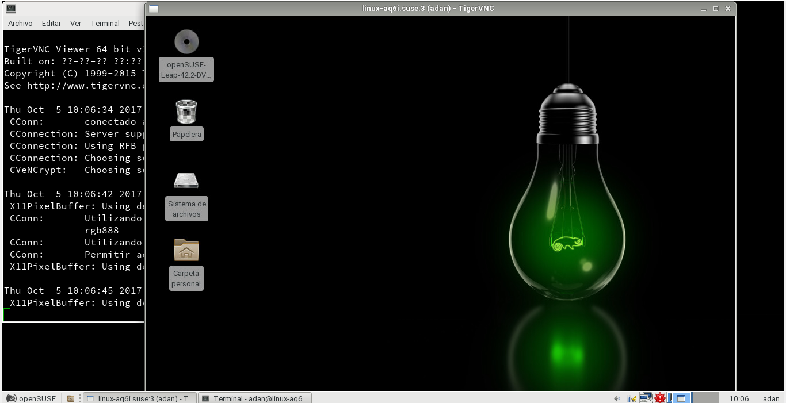

* Con el comando *netstat -ntap* podemos comprobar que está la conexión establecida.

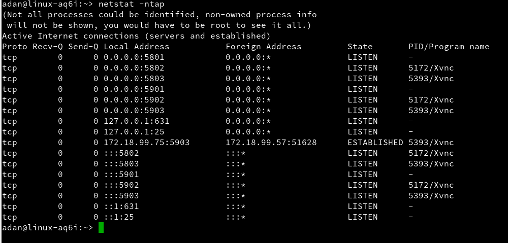

# Windows a Windows

* Configuramos las máquinas de Windows 10.
  - La máquina **servidor** tendrá la IP 172.18.19.11
  - La máquina **cliente** tendrá la IP 172.18.19.12

* Una vez listo, vamos a la página de **tightvnc**, donde descargaremos el servidor y cliente *vnc*.

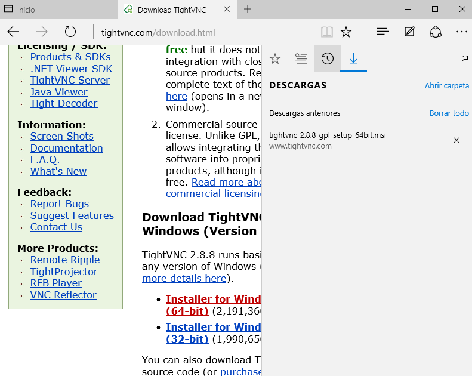

* Y lo instalamos.
  - En la máquina servidor, hacemos *CUSTOM INSTALL* y sólo instalamos el vnc server
  - En la máquina cliente, instalamos sólo el vnc viewer.

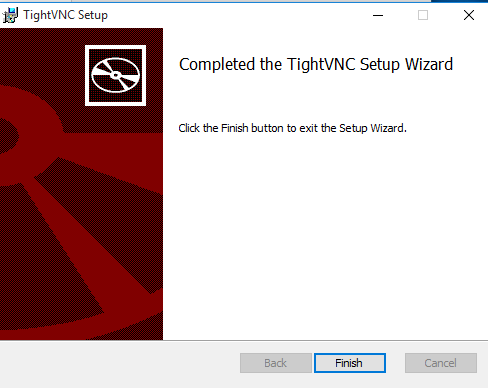

* Abrimos el VNCServer y ponemos una contraseña de control para los clientes.

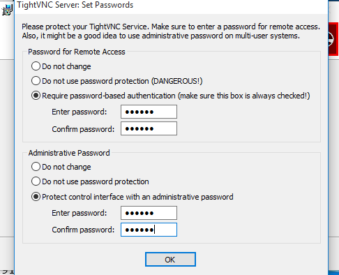

* Luego en *control acces** ponemos la IP del cliente.

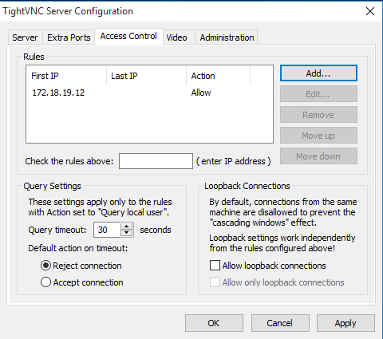

* Volvemos a poner una contraseña de acceso para el cliente.

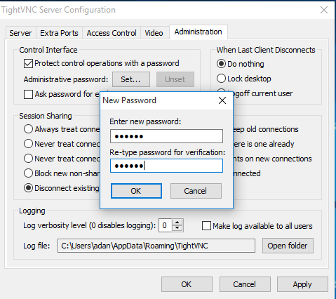

* Ahora, en la máquina **cliente**, abrimos el viewer, y hacemos conexión remota a la IP del servidor, ponemos la contraseña, y conectamos.

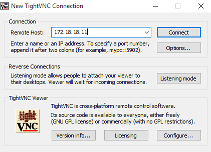

* Y ya deberíamos estar dentro, con lo que estamos en el escritorio del servidor.

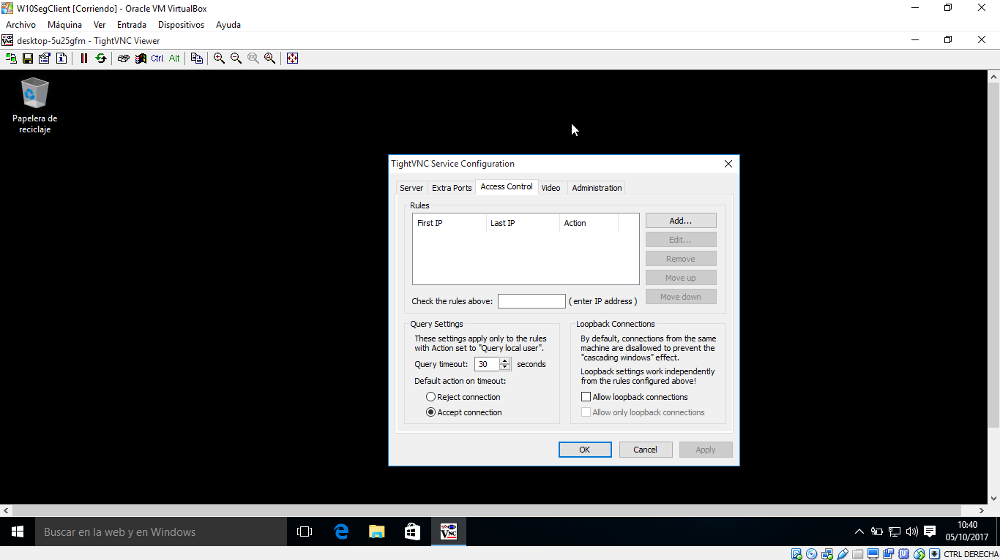

* Como comprobación, utilizamos en la cmd el comando *netstat -n* y vemos que se ha establecido una conexión.

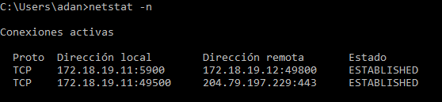

# Windows a OpenSuse

* Con la máquina **servidor de OpenSuse y cliente de Windows**, haremos el mismo trabajo.

* Pasamos a abrir el programa VNC Viewer en Windows, e introducimos la IP de la máquina OpenSuse servidor.

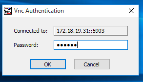

* Y ya entraríamos.

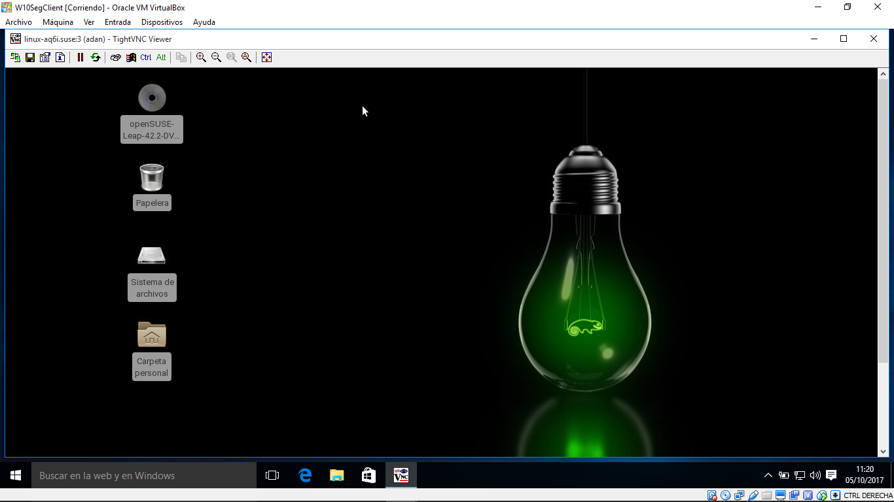

# OpenSuse a Windows

* En la máquina **cliente de OpenSuse** utilizamos el comando *vncviewer*, y cuando nos pida una IP, ponemos la de la máquina **servidor de Windows**

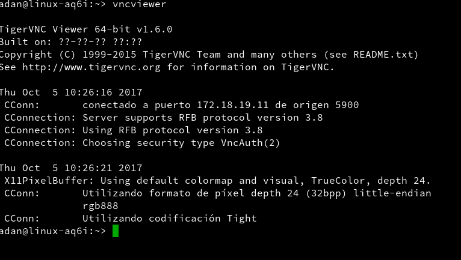

* Con este paso entramos directamente.

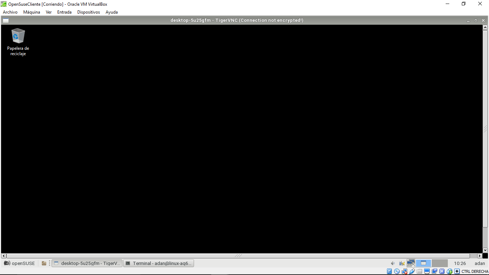

