## Zabbix

0. [Confd](#id0)
1. [Sysload](#id1)
2. [Raids](#id2)
3. [NTP](#id3)
4. [Grafana](#id4)


## Confd <a name="id0"></a>
* The first thing we have to do, is to allow Zabbix to do external commands, so we have to change a little thing on `zabbix_agentd.conf` -> 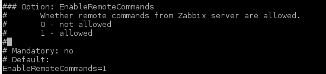 and put it to 1.

* Its good to mention that if you are having some troubles with special characters like `* , / \ |` you may have to unlock unsafe parameters to allow these characters, **but it wont be neccesary for these tasks**.   
 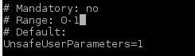

## Sysloads <a name="id1"></a>

* To check the load with the system we can use the command `cat /proc/loadavg`.

The result is that -> 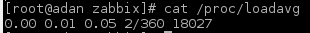

As we can see, there are 5 values.
The first three columns measure CPU and IO utilization of the last one, five, and 10 minute periods. The fourth column shows the number of currently running processes and the total number of processes. The last column displays the last process ID used.

* We want the first value, so we can take this with `cat /proc/loadavg | cut -f 1-1 -d " "`

Our objective is to print this value on a graphic, and we have text, because it is a textfile, so a graphic can't screen that.
A simple way to screen it, is converting it to decimal.

We did that script:

* 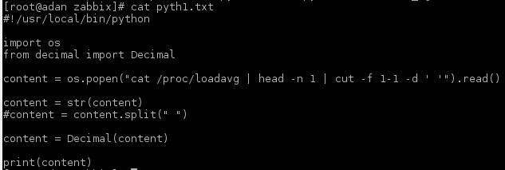

The next step is to add that value or *key* to `zabbix_agentd.conf`, on **UserParameters**.
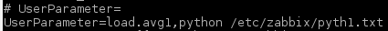

* So now, we can add the new items on Zabbix.

Just go to **Configuration** -> **Hosts**, then pick the host/server Items, and go to **Create Item**.

We should fill like this image, where the name is whatever you want, and the key is the ID you put on *UserParameters*.
The rest of fields you should fill as you wants to configure.

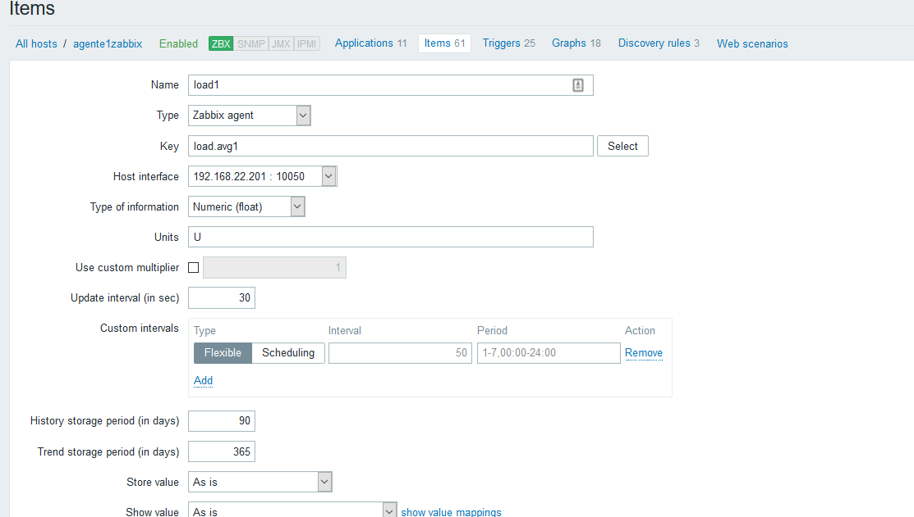

**Remember that we need to create an item**

The last step is to create the graph. Click on **Graphs** 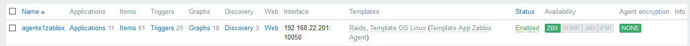 and then **Create Graph**.

You configure your graph as you want, but add the item we have created before, like that:
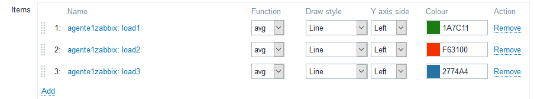

* Then you go to the *Main Menu* of Zabbix, and on *Graphs* you can check your own graph.

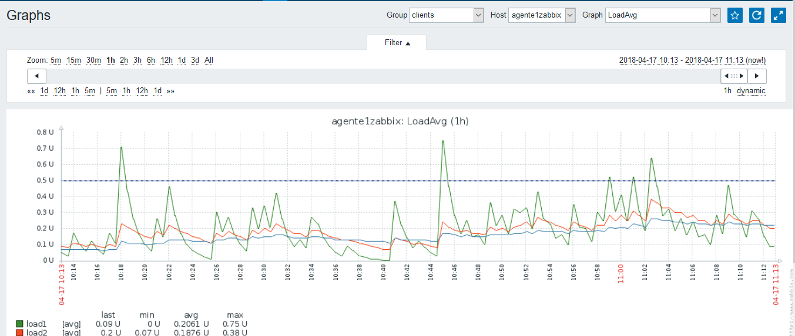

## Raids <a name="id2"></a>

We are going to do a raid 1, that means Redundant Array of Independent Disks, a data storage virtualization technology that combines multiple physical disk drive components into one or more logical units for the purposes of data redundancy, performance improvement, or both.

First, we add a new disk on VirtualBox, and then we mount it on our system (with mdadm, if you haven't got it, `yum install mdadm`).

Once is mounted, we can use this command `mdadm --create --verbose /dev/md0 --level=1 --raid-devices=2 /dev/sdb1 /dev/sdc1` to create de **RAID1**.

The command to check our raid status is `mdadm --detail /dev/md0`
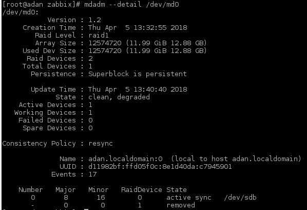

So we can create a Zabbix Screen with that data. Just go to **Administration** -> **Scripts**, and then create.
We could put the previous command, but unfortunately Zabbix have not permission on our system. An easy way is making a script like this on our system: 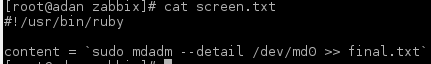.

Now, on Zabbix Scripts, we just need to create one with the command `cat /etc/zabbix/final.txt`.

If we go to **Main Menu** -> **Screens** and we click on the Server/Agent and choose the previous script, it will show us the RAID information.

Also, if we want to check this on Graphs, degradation and disks, we can use default items of Zabbix, so just create a basic graph with the items you want to show.

You can add alerts, so if one raid disk goes down, it will show you a red alert, for example.
On hosts, check **Triggers** and fill it with the options you want. Here you have an example of the first I said, red alert on degradation. By the way, you can create easily the trigger with the **Expression Constructor**.
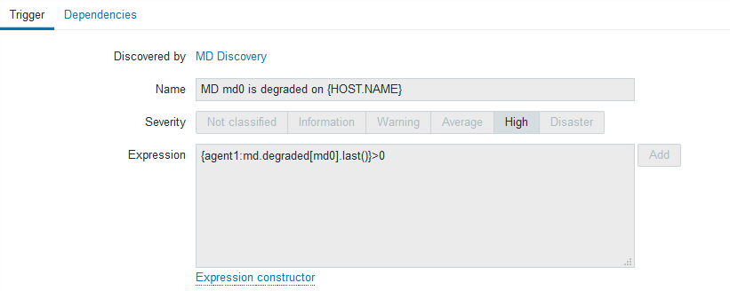


# NTP <a name="id3"></a>
## Installation  
### Server
First of all, you have to install de NTP server on the Debian machine with the follwing command:  
`aptitude install ntp`    

Then, you have to check the status of the service with:  
`systemctl status ntp.service`  

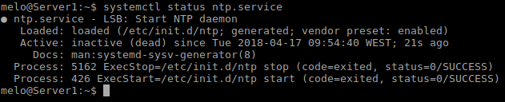  

The service will be down, so you have to start it and then check it again:    

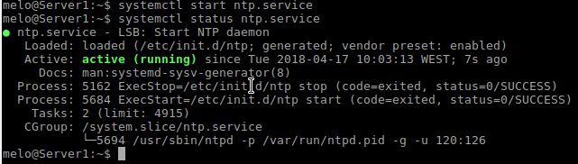  

And finally, it is advisable to enable the start on the boot for the service:    

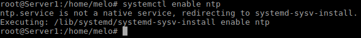  

### Client.  
On the CentOS client, the installation process is the same. The only thing that varies is the installation command:  
`yum install ntp`     

After this, follow the steps shown before on the server part.


## Configuration.  
At this point, the rest of the work will be done on the **client**. Having said that, open `/etc/ntp.conf` file and on the *#Use public servers from...* paragraph, go to the bottom line and add:  
`server 192.168.22.200 iburst`  

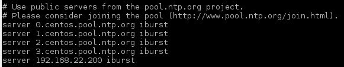   

Then, look for the *# Hosts on local network...* part and add the following line too:  
`restrict 192.168.22.200 mask 0.0.0.0 nomodify notrap`  

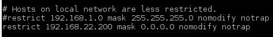  

What this does is restricting the client connection to the *Debian server*.  

Finally, restart the service with:  
`systemctl restart ntp.service`  

## The task.
In order to get the necessary values for setting up a NTP graph, you have to first know the right command, which is shown below:  
`/usr/sbin/ntpdate -q 192.168.22.200`  
Where *192.168.22.200* is the local IP of the server.

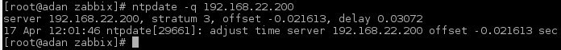

As you can see, there are lots of information that you dont need (only offset and delay values are needed).   
To fulfill this task, we tought that the best option was to create a script with the command, then export the information of the command to a text document and finally send this document to zabbix. We tried to execute the command directly from zabbix but the zabbix user of the client had a lot of troubles with the superuser permissions that we couldnt solve.  

Having said that, lets get to work:   
- Open the terminal and type `crontab -e`
- Then, add the following tasks:    
    `* * * * /usr/sbin/ntpdate -q 192.168.22.200 | cut -f 8-8 -d " " > /etc/zabbix/ntp2.txt`  
    and  
    `* * * * /usr/sbin/ntpdate -q 192.168.22.200 | cut -f 6-6 -d " " > /etc/zabbix/ntp1.txt`   
    where ntpscr(number).txt is the name of the file that will contain the filtered information. Save and exit.  
- Check it with `crotab -l`:  
  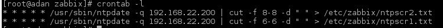   

With the *ntpscr1.txt* and *ntpscr2.txt* files created, you are now ready to import them on zabbix, but first you have to edit the */etc/zabbix/zabbix_agentd.conf* and add the following *UserParmeters* in onder to create the required items for the graphs.
```cmd     
UserParameter=`ntpoffset.ruby /etc/zabbix/ntp2.txt
UserParameter=`ntpdelay.ruby /etc/zabbix/ntp1.txt
```  


It should look like this (we have a few more lines from others scripts):


  


Save and exit.  

Restart the agent with:  
`systemctl restart zabbix_agentd.service`  

Now, go to the frontend and open *Configuration>Hosts>Items* and click on *Create new item* on the top right corner.  
Then, create the following two items with the configuration shown below:    
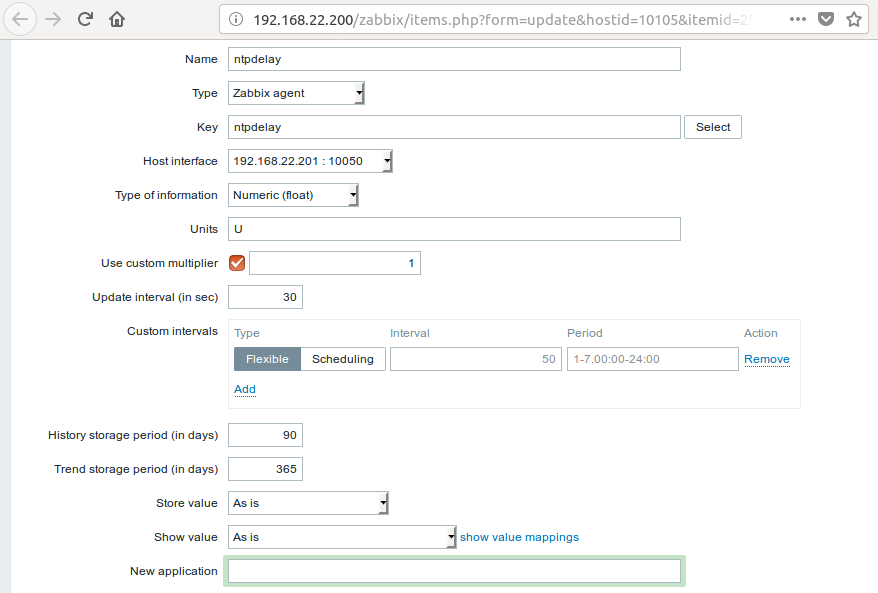    

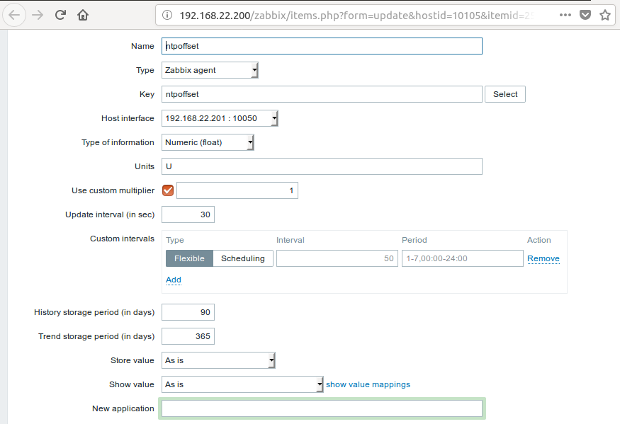  

Save, and go to *Graphs* and click on *Create Graph* to create a graph with these values:  
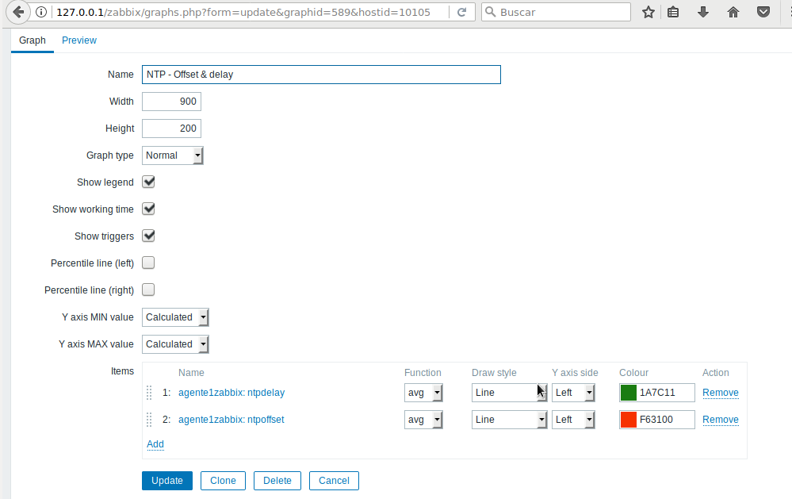  
As you may see, at the bottom part you can add the previously created ntp items.  

And the final product should look similar to something like this:  
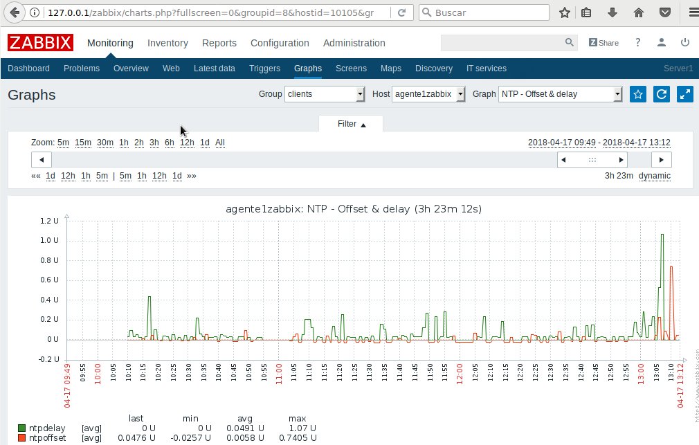

# Grafana <a name="id4"></a>  
## Installation
**The installation is on the server.**  
Firstly, you have to add this line to the `/etc/apt/sources.list`:  

`deb https://packagecloud.io/grafana/stable/debian/ stretch main`  

Then add the Package Cloud key. This allows you to install signed packages:  

`curl https://packagecloud.io/gpg.key | sudo apt-key add -`  

With all this set, we are now ready to update and install this new repository:  

`sudo apt-get update`  
`sudo apt-get install grafana`   

Finally, you have to start the service and enable its automatic boot:   

`sudo service grafana-server start`   
`sudo update-rc.d grafana-server defaults`  


## Configuration.  
Now, you are ready to open Grafana in you browser. Just type `http:://ip-server:3000` where *3000* is the default port used by Grafana. If all goes well, you will see the Grafana login page with *user:admin* and *pass:admin*.  

    

On the home page, you must look for the Zabbix app panel, located on the right side. Then click on the Zabbix app and enable it by pressing the Enable button.   

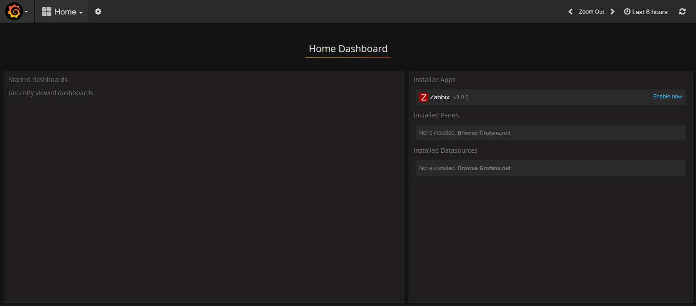  

On the configuration panel, select data sources and click on *Add data source*.  

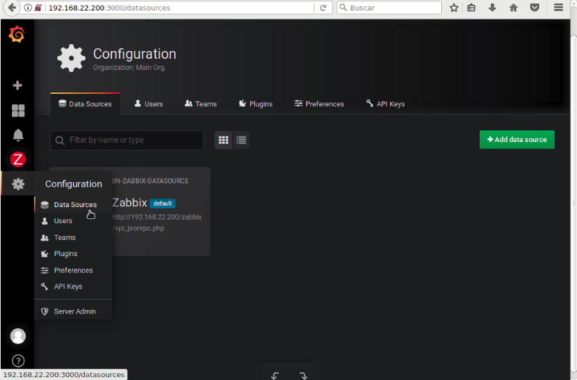

Write the following configuration for the plugin (you might have to replace the IP). Save and test.  

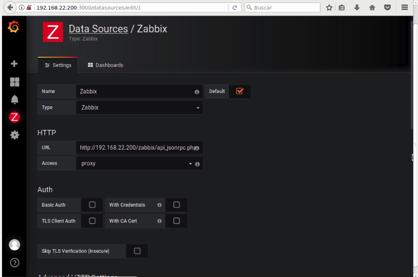  

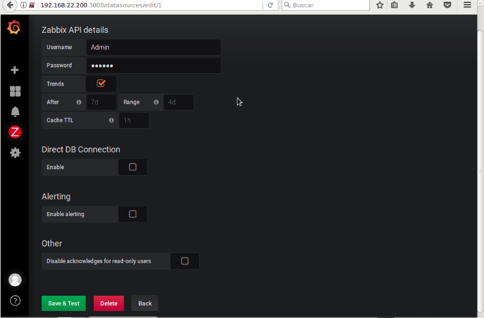   

If its succesful, the page will display this message:  

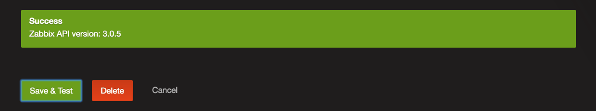   

And finally, go to de Zabbix dashboard to check if Grafana is reciving the information from Zabbix.  

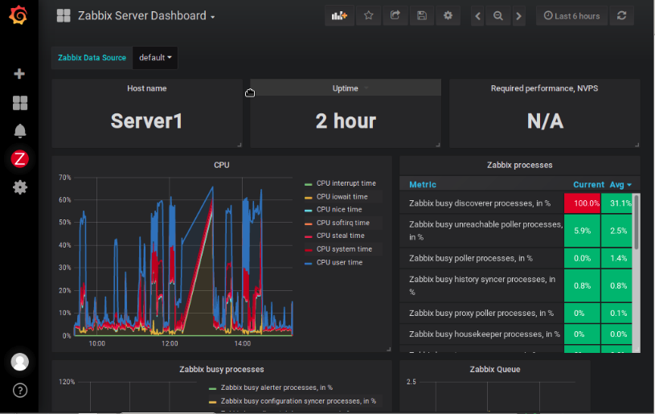
