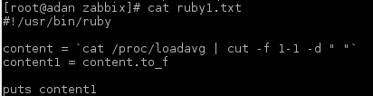
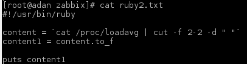
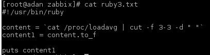
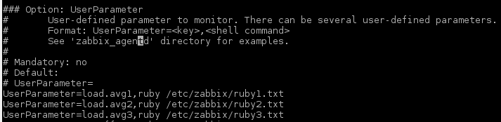

## Zabbix

1. [Sysload](#id1)
2. [Raids](#id2)

## Sysloads 

* To check the load with the system we can use the command `cat /proc/loadavg`.

The result is that -> 

As we can see, there are 5 values.
The first three columns measure CPU and IO utilization of the last one, five, and 10 minute periods. The fourth column shows the number of currently running processes and the total number of processes. The last column displays the last process ID used.

* We want the first three columns, so we can take this values with `cat /proc/loadavg | cut -f 1-3 -d " "`

Our objective is to print this values on a graphic, and we have three numbers, so a graphic can't screen that.
A simple way to screen it, is to divide one per one.

Making scripts for each value, we can take it easy.
Three scripts like these:

* 

* 

* 

The next step is to add these values or *keys* to `zabbix_agentd.conf`, on **UserParameters**.

* So now, we can add the new items on Zabbix.

Just go to **Configuration** -> **Hosts**, then pick the host/server Items, and go to **Create Item**.

We should fill like this image, where the name is whatever you want, and the key is the ID you put on *UserParameters*.
The rest of fields you should fill as you wants to configure.

Remember that we need to create 3 items, because we have 3 values on different scripts, so we repeat the same process but with another ID.

The last step is to create the graph. Click on **Graphs**  and then **Create Graph**.

You configure your graph as you want, but add the 3 items we have created before, like that:

* Then you go to the *Main Menu* of Zabbix, and on *Graphs* you can check your own graph.

## Raids 

We are going to do a raid 1, that means Redundant Array of Independent Disks, a data storage virtualization technology that combines multiple physical disk drive components into one or more logical units for the purposes of data redundancy, performance improvement, or both.

First, we add a new disk on VirtualBox, and then we mount it on our system (with mdadm, if you haven't got it, `yum install mdadm`).

Once is mounted, we can use this command `mdadm --create --verbose /dev/md0 --level=1 --raid-devices=2 /dev/sdb1 /dev/sdc1` to create de **RAID1**.

The command to check our raid status is `mdadm --detail /dev/md0`

So we can create a Zabbix Screen with that data. Just go to **Administration** -> **Scripts**, and then create.
We could put the previous command, but unfortunately Zabbix have not permission on our system. An easy way is making a script like this on our system: .

Now, on Zabbix Scripts, we just need to create one with the command `cat /etc/zabbix/final.txt`.

If we go to **Main Menu** -> **Screens** and we click on the Server/Agent and choose the previous script, it will show us the RAID information.

Also, if we want to check this on Graphs, degradation and disks, we can use default items of Zabbix, so just create a basic graph with the items you want to show.

You can add alerts, so if one raid disk goes down, it will show you a red alert, for example.
On hosts, check **Triggers** and fill it with the options you want. Here you have an example of the first I said, red alert on degradation. By the way, you can create easily the trigger with the **Expression Constructor**.

